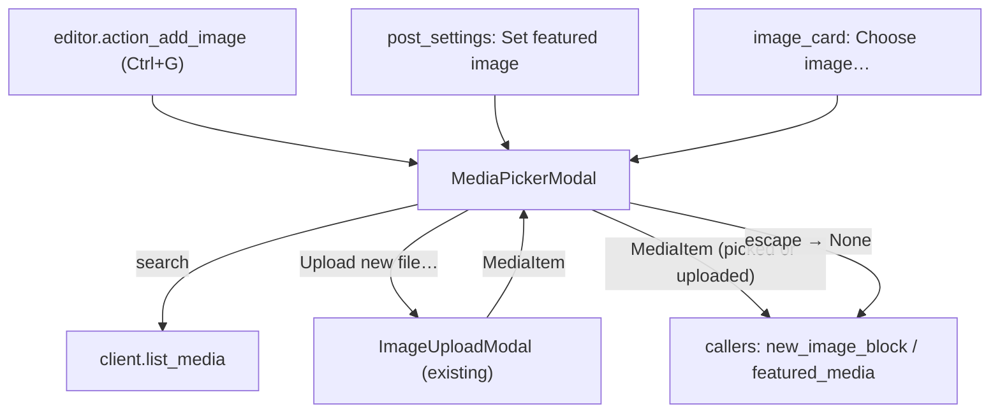
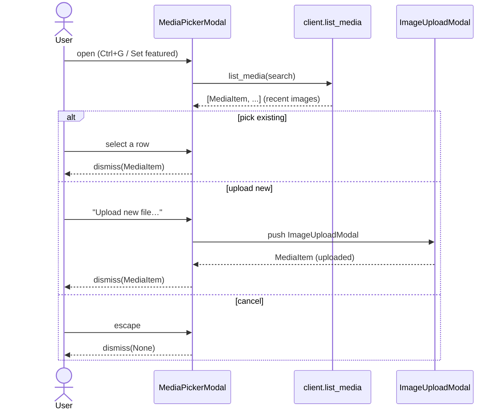

# feat: Select an existing image from the media library

## Summary

Today an image can only be added by uploading a fresh file — both for inline image blocks
(`Ctrl+G`) and for a post's featured image (settings screen). There's no way to reuse an
image already in the library, so uploading a body image and then reusing it as the featured
image means uploading it twice.

Close the gap with a **unified media picker**: opening the image flow shows a searchable
list of existing library images, with "Upload new file…" available as an option inside it.
Both entry points (inline blocks and featured image) route through the same picker, which
returns a `MediaItem` whether the user picked an existing image or uploaded a new one — so
the downstream code (mint an image block / set `featured_media`) is unchanged.

This builds directly on the editorial work in
`docs/plans/2026-07-11-001-feat-editorial-experience-and-image-upload-plan.md`
(now shipped): `MediaItem`, `upload_media`/`get_media`, `ImageUploadModal`, and
`new_image_block`. The picker mirrors the existing `TermPicker` pattern.

Product Contract preservation: solo-sourced (`ce-plan-bootstrap`); no upstream brainstorm.
Scope confirmed with the user: **unified picker** (picker becomes the primary image entry;
upload is reached from inside it), not a separate second action.

---

## Problem Frame

The two image entry points both push `ImageUploadModal` directly:
- Inline: `wptui/screens/editor.py` `action_add_image` → `ImageUploadModal` → `_image_uploaded` inserts a block.
- Featured: `wptui/screens/post_settings.py` `_set_featured` → `ImageUploadModal` → `_featured_chosen` sets `featured_media`.

Nothing reads the existing media library. The REST API exposes it (`GET /wp/v2/media`), and
the client already talks to `/media` for upload/fetch — the gap is a list method plus a
picker UI. A TUI can't render thumbnails, so the picker lists images as text rows
(filename, type, id) with search — the same shape as the working `TermPicker`.

---

## Requirements

- **R1** — Adding an inline image (`Ctrl+G`) opens a picker listing existing library images; selecting one inserts an image block referencing it.
- **R2** — Setting a featured image opens the same picker; selecting one sets the post's `featured_media`.
- **R3** — The picker is searchable (by filename/title) and shows recent images by default; it lists images only (not arbitrary media types).
- **R4** — "Upload new file…" inside the picker opens the existing upload flow; a successful upload flows back out of the picker as the selection (so the caller treats picked-vs-uploaded identically).
- **R5** — Cancelling the picker (escape) makes no change — no block inserted, no featured image set.
- **R6** — The existing lossless round-trip and the featured-image save path are unchanged; a picked existing image mints the same `core/image` block / `featured_media` id as an uploaded one.

---

## Key Technical Decisions

- **KTD1 — One picker, returns `MediaItem`.** `MediaPickerModal` is a `ModalScreen[MediaItem]` that dismisses with the chosen `MediaItem` (existing or freshly uploaded) or `None` on cancel. Both callers already have a `MediaItem`-shaped callback, so they need only swap which modal they push. *Alternative rejected:* separate "pick" vs "upload" actions — the user chose the unified entry; it means fewer keybindings and one mental model.
- **KTD2 — Upload chains through the picker.** The picker's "Upload new file…" pushes the existing `ImageUploadModal`; when it returns a `MediaItem`, the picker immediately dismisses with that same item. `ImageUploadModal` is untouched — it's just no longer pushed directly by the callers. *Alternative rejected:* duplicating upload UI in the picker.
- **KTD3 — Mirror `TermPicker`, single-select.** Reuse the proven `TermPicker` structure (search `Input` + `@work` fetch + list widget + `is_mounted` guards) but single-select: a row's selection dismisses with that image. Use a `ListView`/`OptionList`-style single-select list rather than the multi-select `SelectionList`. *Alternative rejected:* a `DataTable` — heavier than needed for a single-column pick.
- **KTD4 — List images only, recent-first, search-filtered.** `list_media` calls `GET /wp/v2/media?media_type=image&orderby=date&order=desc&per_page=30` (+ `search`). No pagination beyond the first page in v1 (search narrows instead). *Alternative rejected:* full pagination UI — deferred.
- **KTD5 — Text rows (no thumbnails).** A terminal can't render images; rows show filename (from `source_url` basename) + mime + id. This is inherent to the medium, not a compromise to revisit.

---

## High-Level Technical Design

Unified entry — both callers push the same picker, which returns a `MediaItem`:

Pick-existing vs upload-new, both exiting as one selection:

---

## Implementation Units

### U1. `list_media` client method

**Goal:** Read recent/searched images from the media library.
**Requirements:** R3, KTD4.
**Dependencies:** none (extends the existing `MediaItem` + client).
**Files:** `wptui/api/client.py`, `tests/test_client_editorial.py`.
**Approach:** Add `list_media(search=None, *, per_page=30)` → `GET /wp/v2/media` with
`context=edit`, `media_type=image`, `orderby=date`, `order=desc`, `per_page`, and the
existing MediaItem `_fields` (`id,source_url,alt_text,caption,title,mime_type`); add
`search` when given. Reuse `_json` + list-shape guard (mirror `list_terms`). Return
`list[MediaItem]` via `MediaItem.from_json`.
**Patterns to follow:** `list_terms` in `wptui/api/client.py` (search param, list guard, `_json`).
**Test scenarios:**
- Covers R3. `list_media()` GETs `/wp/v2/media` with `media_type=image` and `orderby=date`; returns parsed `MediaItem`s (MockTransport).
- Covers R3. `list_media("cat")` includes `search=cat` in the query.
- A non-list response raises `ApiError`; a list with a non-dict entry is skipped, not crashed.
**Verification:** unit tests green; the request carries the image filter and search.

### U2. `MediaPickerModal` widget

**Goal:** A searchable modal to pick an existing image or trigger an upload, returning a `MediaItem`.
**Requirements:** R1, R2, R3, R4, R5, KTD1–KTD3, KTD5.
**Dependencies:** U1.
**Files:** `wptui/widgets/media_picker.py`, `wptui/app.tcss`, `tests/test_media_picker.py`.
**Approach:** `MediaPickerModal(ModalScreen[MediaItem])`. Compose: a search `Input`, a
single-select list (`ListView`/`OptionList`) of image rows (`filename — mime (#id)`), and
an "Upload new file…" `Button`. On mount and on search submit, an `@work` worker calls
`list_media` and repopulates the list (guard post-await UI with `is_mounted`, per the
editorial review fix). Selecting a row dismisses with that `MediaItem`. The upload button
pushes `ImageUploadModal`; its callback, if it returns a `MediaItem`, dismisses the picker
with that item (KTD2). Escape dismisses `None`. Keep a row→`MediaItem` map so selection
resolves back to the full object.
**Patterns to follow:** `wptui/widgets/term_picker.py` (search + `@work` fetch + `is_mounted`
guards + dismiss); `wptui/widgets/image_upload.py` (modal + push/callback chaining); modal
CSS blocks already in `wptui/app.tcss`.
**Test scenarios:**
- Covers R1/R3. Opening the picker lists images from a fake `list_media`; selecting a row dismisses with that `MediaItem` (id/source_url intact).
- Covers R3. Typing a search term and submitting re-queries `list_media` with the term and repopulates the list.
- Covers R4. Pressing "Upload new file…" opens `ImageUploadModal`; when it returns a `MediaItem`, the picker dismisses with that same item (chained result).
- Covers R5. Escape dismisses with `None` (no selection).
- Edge: an empty library (no rows) still lets the user reach "Upload new file…"; a failed `list_media` surfaces a status message without crashing.
**Verification:** widget/pilot tests drive select, search, upload-chain, and cancel; the dismissed value matches the picked/uploaded item or `None`.

### U3. Route inline + featured + card entries through the picker

**Goal:** Make the picker the entry point everywhere an image is added.
**Requirements:** R1, R2, R4, R5, R6.
**Dependencies:** U2.
**Files:** `wptui/screens/editor.py`, `wptui/screens/post_settings.py`, `wptui/widgets/image_card.py`, `tests/test_media_picker.py` (integration), `tests/test_image_upload.py` (adjust), `tests/test_post_settings.py` (adjust).
**Approach:** Swap the pushed modal from `ImageUploadModal` to `MediaPickerModal` in three
places, keeping the existing callbacks (they already receive a `MediaItem | None`):
- `editor.action_add_image` → push `MediaPickerModal`; `_image_uploaded` unchanged (inserts `new_image_block`). Rename the binding label to "Add image" (already apt).
- `post_settings._set_featured` → push `MediaPickerModal`; `_featured_chosen` unchanged.
- `image_card` "Upload file…" button → relabel to "Choose image…", push `MediaPickerModal`, keep `_uploaded` field-fill callback.
Update the two existing tests that asserted `ImageUploadModal` appears directly on `Ctrl+G`
/ featured-set to expect `MediaPickerModal` (and reach the upload modal via the picker's
"Upload new file…" where they exercise upload).
**Patterns to follow:** the current `action_add_image`/`_set_featured` push+callback wiring.
**Test scenarios:**
- Covers R1/R6. `Ctrl+G` → picker → select an existing image → a `core/image` block referencing it is inserted and serializes losslessly.
- Covers R2/R6. Settings "Set featured image" → picker → select existing → `PostSettings.featured_media` is set to that id.
- Covers R4. `Ctrl+G` → picker → "Upload new file…" → upload → block inserted (the pre-existing upload path still works, now one hop deeper).
- Covers R5. Cancelling the picker from either entry makes no change (no block, `featured_media` untouched).
**Verification:** the ctrl+g and featured-image flows work through the picker for both pick-existing and upload-new; the full existing suite stays green.

---

## Scope Boundaries

**In scope:** a searchable, image-only media picker as the unified entry for inline image
blocks, featured image, and the image-card affordance; "Upload new file…" reachable inside
it; recent-first listing with search.

**Deferred to Follow-Up Work:**
- Pagination / infinite scroll beyond the first page of results (search is the v1 narrowing tool).
- Media detail editing from the picker (rename/alt/delete) — the picker only selects.
- Non-image media (audio/video/documents) and media-type filters.
- Any thumbnail/preview rendering (not feasible in a text terminal).

---

## Risks & Dependencies

- **Large libraries.** Sites with thousands of images: the first 30 recent + search is
  usable but not exhaustive. *Mitigation:* recent-first ordering + search covers the common
  "reuse the image I just uploaded" case (it'll be at the top); pagination is deferred.
- **Row identity.** The list shows text; the picker must map the selected row back to the
  full `MediaItem` (not just an id) so the caller gets `source_url`. *Mitigation:* keep an
  index→`MediaItem` map built when the list is populated (like `TermPicker`'s id tracking).
- **Async dismiss races.** Selecting/uploading while a `list_media` fetch is in flight.
  *Mitigation:* reuse the `is_mounted` guard pattern added in the editorial review fix.
- **Dependency:** the shipped editorial feature (`MediaItem`, `ImageUploadModal`,
  `new_image_block`, `upload_media`) — all present on the current branch.

---

## Verification Contract

- **Unit:** `test_client_editorial.py` covers `list_media` (image filter, search, error shape) via `httpx.MockTransport`.
- **Widget/pilot:** `test_media_picker.py` drives select-existing, search, upload-chain, and cancel; integration cases confirm `Ctrl+G` and featured-image both route through the picker and produce the same block / `featured_media` as before.
- **Regression:** the full existing suite (148 tests) stays green; adjusted expectations in `test_image_upload.py` / `test_post_settings.py` reflect the picker-first entry (upload reached via the picker).
- **Manual (against a real WP install):** upload a body image, then set it as the featured image by picking it from the library (no re-upload); confirm the same media id is referenced.

## Definition of Done

- R1–R6 satisfied; each feature-bearing unit's test scenarios implemented and green.
- Inline image, featured image, and the image-card affordance all open the picker; pick-existing and upload-new both work and are indistinguishable to downstream code.
- `wptui/widgets/media_picker.py` and `wptui/blocks`/`wptui/inline` stay `textual`-free where they already are (the picker is a widget; the client/factory changes stay headless).
- Existing suite still green; new code covered by tests following the `TermPicker`/`ImageUploadModal` patterns.

---

## Sources & Research

- Local: `wptui/widgets/term_picker.py` (searchable picker pattern), `wptui/widgets/image_upload.py` (modal + chained callback), `wptui/screens/editor.py` `action_add_image`, `wptui/screens/post_settings.py` `_set_featured`, `wptui/widgets/image_card.py`, `wptui/blocks/factory.py` `new_image_block`, `wptui/api/client.py` `list_terms`/`upload_media`/`get_media`, `wptui/api/dto.py` `MediaItem`.
- WordPress REST API v2 (stable, already consumed by this client): `GET /wp/v2/media` with `media_type=image`, `search`, `orderby`/`order`, `per_page`. No external research required.
