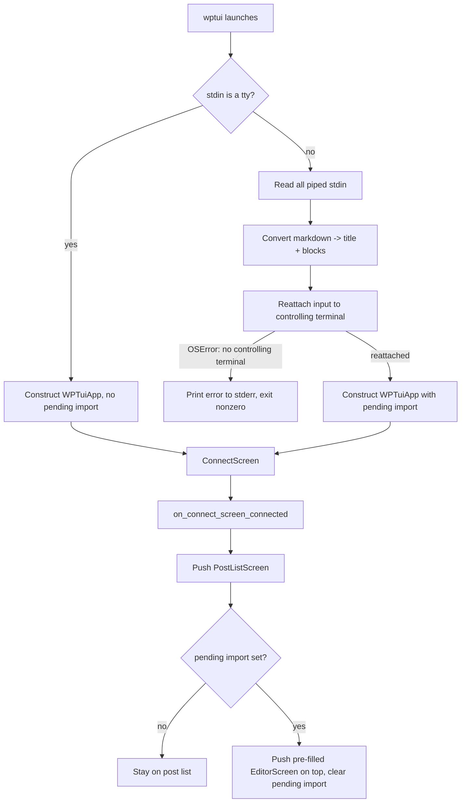

# feat: Pipe markdown to create and open a post

## Summary

Piping a markdown document into wp-tui (`cat notes.md | wptui`, `pbpaste | wptui`) converts it into WordPress blocks and opens the editor pre-filled with that content, staged like any other new post until saved. Conversion walks a `markdown-it-py` block tree to generate WordPress's own block-comment HTML, then reuses the existing block parser rather than building the block tree directly. The pre-filled editor lands on top of the post list (not in place of it), so back/Escape behaves like any other editor session.

## Problem Frame

wp-tui has no path today for getting external content — an LLM chat response, an Obsidian note — into a post other than typing it by hand, block by block, inside the running editor. The comparable habit in wp-admin is pasting into the browser's block editor and letting Gutenberg convert it on the spot; wp-tui has no equivalent (see origin: docs/brainstorms/2026-07-14-pipe-markdown-create-post-requirements.md).

---

## Key Technical Decisions

- **Markdown parser: `markdown-it-py`, walked via its `SyntaxTreeNode` tree.** Of the surveyed options (`markdown-it-py`, `mistune`, `marko`, `python-markdown`), it's the only one where each block's raw, unparsed inline markdown text is available as a plain string (`inline` node `.content`) without reconstructing it from a pre-parsed inline token tree — a direct fit for handing off to the existing inline converter. It's also CommonMark-correct on nested lists and adds one small dependency (`mdurl`).
- **Generate WordPress's block-comment HTML text, then reuse the existing parser — don't build the block tree directly.** Each markdown node renders to the exact `<!-- wp:heading -->…<!-- /wp:heading -->`-style text WordPress itself produces (confirmed shapes: paragraph, heading with `level` attribute, list with nested list-item children, quote wrapping a nested paragraph, code), concatenated with the existing blank-line block separator, then fed to `wptui.blocks.parse()`. This inherits nesting/interleaving correctness the parser already has, rather than reimplementing it.
- **Inline text always routes through the existing inline converter.** Each leaf node's raw inline text is converted via `document_to_html(markdown_to_document(text))` before being embedded in the generated block HTML — the same call `TextBlockEditor.commit()` already makes, so bold/italic/code/links behave identically to hand-typed content.
- **Unmapped block-level constructs fall back to a plain paragraph of their raw text, not silent loss.** Anything markdown-it-py parses that isn't one of the explicitly mapped node types (raw HTML blocks, thematic breaks, GFM tables — the base CommonMark parser doesn't even recognize table syntax without an extension, so it already falls through as plain text) becomes a paragraph block containing its source text.
- **Images are filtered out at the inline-node level, not left in the raw text handed to the inline converter.** Markdown images are inline nodes (``), not block-level ones — handing a leaf's whole raw `.content` string to the existing inline converter unmodified would have it read the image as a literal `!` followed by an ordinary markdown link, producing a stray clickable link rather than a clean drop. Each leaf's inline children are walked individually; `image` children are skipped and the surrounding text/emphasis/link/code-span children are reassembled before conversion, so images disappear cleanly instead of surfacing as broken links. Recovering or acknowledging dropped images (e.g., a placeholder or a count) is out of scope for v1 — see Scope Boundaries.
- **Inline formatting support is bounded by what the existing inline converter already recognizes.** `wptui.inline`'s hand-rolled parser understands `*`/`**`/`***` emphasis, `` ` `` code spans, and `[text](url)` links — it does not recognize CommonMark's underscore emphasis (`_em_`, `__strong__`). This is a pre-existing limitation of the converter this plan reuses, not a gap this plan introduces; extending `wptui.inline` to cover underscore emphasis is out of scope here (see Scope Boundaries) since it would touch the hand-typed editing path too, not just markdown import.
- **Any failure while handling piped input before the app launches is a hard failure, not just terminal-reattachment failures.** Reading stdin, decoding it, and converting it all run before `WPTuiApp` is constructed. An unhandled exception anywhere in that sequence — not only the terminal-reattachment `OSError` — is caught, reported to stderr, and exits nonzero, so a malformed or unusual piped input never surfaces as a raw traceback instead of the same clear failure path R3 already defines.
- **Leading title detection is a tree-position check, not "first heading found."** Only a heading that is the parsed document's very first top-level child, at level 1, is stripped out and used as the title. A second consecutive top-level H1 stays a body heading block; an H1 nested inside a blockquote or list is never a title candidate — checking by token order instead of tree position would incorrectly pull a heading out of a quote or list and destroy it.
- **Terminal reattachment: `os.dup2(os.open(os.ctermid(), os.O_RDWR), 0)`, not reassigning `sys.stdin`.** Textual's installed driver (`textual==8.2.8`) reads `sys.__stdin__.fileno()` and issues raw `os.read()` syscalls on it — reassigning the Python-level `sys.stdin` name has no effect on what the driver actually reads. `dup2`ing the real terminal onto file descriptor 0 is what the driver will pick up. This is a known, currently-unresolved gap in Textual itself (see Sources).
- **No controlling terminal is a hard failure, not a degraded fallback.** When `os.open(os.ctermid(), ...)` raises `OSError` (confirmed as `ENXIO` in a detached-process test), the process prints an error to stderr and exits with a nonzero status before `WPTuiApp` is ever constructed — no headless or partially-interactive launch is attempted.
- **The pre-filled editor opens on top of the post list, not instead of it.** `WPTuiApp.on_connect_screen_connected` pushes `PostListScreen()` first, exactly as every existing entry point does, then pushes the pre-filled `EditorScreen` on top with the same `_after_editor` reload callback `post_list.py` already uses for its other editor pushes. This keeps Escape/back consistent with every other editor session (pop lands on a live post list) while still satisfying "opens directly into the editor" as the first thing the user sees.
- **The pre-filled editor skips the "resume an unsaved draft?" prompt.** `_maybe_offer_resume_new` scans all site-wide unsaved-new-post snapshots and isn't scoped to the current session; running it against freshly piped content risks offering an unrelated stale draft and silently discarding the import if declined incorrectly. The import itself is the current unsaved state, so the prompt is skipped entirely for this path.
- **The pre-filled editor writes its first autosave snapshot synchronously on mount**, rather than waiting for the next timer tick (autosave runs on a 2-second interval). Piped content arrives instantly and fully formed, so the usual "typing takes longer than the first tick" assumption doesn't hold — a quit within that window would otherwise lose it with no recovery snapshot.
- **Extracted title text is always plain text, independent of the HTML-embedding path used for body content.** The title field is a plain `Input` widget, not an HTML renderer — a leading H1 like `# My **Bold** Title` must resolve to "My Bold Title" in the title field, with formatting discarded entirely, rather than leaving markdown markers in place or leaking HTML tags into the input.
- **Focus on mount depends on whether a title was extracted**, mirroring the deliberateness of the existing blank-post path (`_start_blank` explicitly focuses the title input). When the import yields no title, focus goes to the title input, same as a blank new post. When a title was extracted from a leading H1, the title is already filled in, so focus goes to the first block in the canvas instead.
- **The imported-content status line commits to an exact, pluralization-safe string**, following the existing `{count} block(s)` convention the load path already uses (`f"status: {detail.status} · {len(blocks)} block(s) · Ctrl+E settings · Ctrl+S to save"`): `f"Imported {n} block(s) · Ctrl+E settings · Ctrl+S to save"`, where `n` is the count of top-level blocks (0 included).

---

## Requirements

**Invocation & terminal handling**
- R1. Running `wptui` with non-terminal stdin is detected automatically (`sys.stdin.isatty()` is false) and treated as markdown to import — no flag or subcommand required.
- R2. The full piped input is read before `WPTuiApp` is constructed, and the process's input is reattached to the controlling terminal before the app runs, so keyboard/mouse input works normally afterward.
- R3. If no controlling terminal is available to reattach to, the process prints a clear error to stderr and exits with a nonzero status without ever launching the app.
- R16. Any failure while reading, decoding, or converting piped input — not only a terminal-reattachment failure — prints a clear error to stderr and exits with a nonzero status before the app launches.

**Markdown conversion**
- R4. Headings, paragraphs, lists (including nesting), blockquotes, and fenced code blocks convert to their corresponding WordPress core blocks.
- R5. Inline formatting recognized by the existing inline converter (`*`/`**`/`***` emphasis, code spans, links) is preserved inside converted blocks; CommonMark underscore emphasis (`_em_`, `__strong__`) is not recognized, matching that converter's existing behavior on hand-typed content.
- R6. Markdown image syntax is filtered out before inline conversion runs, so it never surfaces as a WordPress image block or as a broken literal link.
- R7. Content with no recognizable markdown syntax, or a block-level construct with no explicit mapping, converts to a plain paragraph block containing its raw text rather than being silently dropped.

**Title & post creation**
- R8. A heading is stripped and used as the post title only when it is the single, very-first top-level node of the document at level 1; it is not duplicated as a body block. A second top-level heading, or an H1 nested in a quote or list, is never treated as the title.
- R9. Absent a qualifying leading H1, the post title starts blank.
- R10. The post type defaults to "post".
- R11. No WordPress API write happens until the user's first save — the imported content behaves exactly like any other new, unsaved post, including autosave/crash-recovery snapshotting.

**Editor integration**
- R12. After the existing interactive connect flow completes unchanged, the app opens the post list as usual, then immediately opens a pre-filled editor with the converted content on top of it.
- R13. The pre-filled editor does not show the "resume an unsaved draft?" prompt.
- R14. The pre-filled editor writes a crash-recovery snapshot synchronously on mount, before the first timer-driven autosave tick.
- R15. The pre-filled editor's status line distinguishes an import (including a zero-block import) from an ordinary blank new post, using an exact, pluralization-safe count of imported blocks.

---

## Acceptance Examples

- AE1. **Covers R1, R12.** Given `cat notes.md | wptui` where `notes.md` contains headings and a list. When the app launches and the user completes the normal connect flow. Then the post list opens as usual and a pre-filled editor with the converted blocks opens on top of it.
- AE2. **Covers R8, R9.** Given piped markdown opening with `# My Post Title` followed by body content. When converted. Then the title field reads "My Post Title" and the body has no duplicate heading block. Given piped markdown with no leading H1. When converted. Then the title field is blank. Given a leading H1 containing inline formatting (`# My **Bold** Title`). When converted. Then the title field reads "My Bold Title" — plain text, with formatting discarded rather than left as markup or leaked HTML.
- AE3. **Covers R8.** Given piped markdown opening with two consecutive top-level H1s. When converted. Then only the first becomes the title; the second remains a heading block in the body. Given an H1 nested inside a blockquote or list item anywhere in the document. When converted. Then it is never treated as the title, regardless of position in the raw text.
- AE4. **Covers R3.** Given wptui is invoked with piped stdin in a context with no controlling terminal available. When it attempts to reattach input after reading the piped content. Then it exits with a clear stderr error and nonzero status rather than opening a broken or partial session.
- AE5. **Covers R7.** Given content copied as plain text from a Google Doc, where headings and bold text were visually styled but carry no markdown syntax once copied as plain text. When converted. Then the result is plain paragraph blocks with no heading/list/bold structure — expected, not an error.
- AE6. **Covers R6.** Given piped markdown containing `` syntax alongside ordinary paragraphs. When converted. Then no image block or broken reference appears in the output, and the surrounding paragraphs convert normally.
- AE7. **Covers R12, R13.** Given a piped-content launch where an unrelated stale new-post snapshot already exists for the connected site. When the pre-filled editor mounts. Then no "resume an unsaved draft?" prompt appears, and pressing Escape afterward pops to a live, reloaded post list rather than the connect screen.
- AE8. **Covers R15.** Given piped markdown that converts to zero blocks (e.g., empty or whitespace-only input). When the editor mounts. Then its status line reads "Imported 0 block(s) · Ctrl+E settings · Ctrl+S to save" rather than the ordinary "New post" message, so the user isn't left wondering whether the import silently failed.
- AE9. **Covers R16.** Given piped input that causes an unexpected exception during decoding or conversion (not a terminal-reattachment failure). When wptui processes it. Then it prints a clear error to stderr and exits nonzero before the app ever launches, rather than surfacing a raw traceback.

---

## High-Level Technical Design



---

## Implementation Units

### U1. Stdin capture + terminal reattachment helper

- **Goal:** Read piped stdin, if present, and safely reattach the process's own input to the controlling terminal before the Textual app starts.
- **Requirements:** R1, R2, R3
- **Dependencies:** none
- **Files:** `wptui/stdin_import.py` (new), `tests/test_stdin_import.py` (new)
- **Approach:** Two pure functions with no `textual` import, mirroring the headless style of `wptui/paths.py`: one that returns the piped content (or `None` if stdin is a tty), and one that reattaches file descriptor 0 to the controlling terminal, raising a dedicated error type on failure. The calling sequence (read, then always attempt reattachment, then construct `WPTuiApp`) is wired up in U4, which owns `wptui/__main__.py`.
- **Technical design** (directional, not a spec):
  ```
  def read_piped_input() -> str | None:
      if sys.stdin.isatty():
          return None
      return sys.stdin.read()

  def reattach_controlling_terminal() -> None:
      try:
          tty_fd = os.open(os.ctermid(), os.O_RDWR)
      except OSError as exc:
          raise NoControllingTerminalError from exc
      os.dup2(tty_fd, 0)
      if tty_fd != 0:
          os.close(tty_fd)
  ```
- **Test scenarios:**
  - Stdin is a tty -> `read_piped_input()` returns `None`.
  - Stdin is non-tty with content -> returns the full content, byte-for-byte.
  - Piped content is empty or whitespace-only -> returns `""`/whitespace, not `None` — distinguishes "piped but empty" from "not piped".
  - `os.open`/`os.ctermid()` raises `OSError` -> `reattach_controlling_terminal()` raises the dedicated error. (The end-to-end "no app launch" behavior this enables is verified at the `__main__` level in U4, which owns that wiring.)
  - Mock `os.open`/`os.dup2` rather than exercising a real terminal, since pytest's captured stdio isn't a real tty.
  - On a platform without `os.ctermid()` (Windows), `reattach_controlling_terminal()` raises the same dedicated error type with a message naming the platform gap, rather than an unhandled `AttributeError`.
- **Verification:** Unit tests pass headlessly with mocked `os` calls; a manual `cat file.md | wptui` smoke test confirms real end-to-end behavior in an actual terminal.

### U2. Markdown-to-WordPress-block converter

- **Goal:** Convert a markdown document into WordPress block-comment HTML text plus an extracted title, using `markdown-it-py`.
- **Requirements:** R4, R5, R6, R7, R8, R9
- **Dependencies:** none (standalone; consumed by U4)
- **Files:** `wptui/blocks/markdown_import.py` (new), `tests/test_markdown_import.py` (new), `pyproject.toml` (add `markdown-it-py` dependency)
- **Approach:** Parse the input into a `markdown_it` `SyntaxTreeNode` tree and walk its top-level children. Map `heading` (with a `level` attribute for h2-h6), `paragraph`, `bullet_list`/`ordered_list` (with nested `list_item` children), `blockquote` (wrapping a nested paragraph block), and `fence`/`code_block` to the corresponding WordPress block-comment shapes. For each leaf, walk its inline children individually rather than taking the leaf's raw `.content` string as a whole: reassemble the text/emphasis/code-span/link children back into a markdown-style string, skipping any `image` child entirely, then run that reassembled string through `document_to_html(markdown_to_document(text))` (`wptui.inline`) before embedding it — this is what keeps a dropped image from surfacing as a stray literal link. If the tree's first top-level child is a level-1 heading, remove it from the emitted sequence; extract its title text as plain text with all inline formatting discarded (not run through the HTML-embedding path, since the title is a plain `Input` field, not an HTML renderer). Any exception raised during parsing or rendering propagates to the caller (U4 wraps it into the same clear-failure path R16 defines) rather than being swallowed here. Concatenate the remaining top-level blocks with the existing blank-line separator and feed the result to `wptui.blocks.parse()`.
- **Technical design** (directional, not a spec):
  ```
  def convert_markdown(markdown_text: str) -> tuple[str, list[Block]]:
      tree = build_tree(markdown_text)
      title, body_nodes = extract_leading_h1(tree.children)  # title as plain text, formatting discarded
      html_text = "\n\n".join(render_node(n) for n in body_nodes)  # render_node skips image inline children
      return title, parse(html_text)
  ```
- **Test scenarios:**
  - A document with a leading H1, a paragraph containing bold/italic/a link, a nested list, a blockquote, and a fenced code block converts to the expected block shapes, and the H1 becomes the title.
  - Inline formatting inside a converted paragraph round-trips through the existing inline converter into correct WordPress HTML.
  - No leading H1 -> title is `""`, and the first content block is a real body block (nothing dropped).
  - A leading H1 containing inline formatting (`# My **Bold** Title`) -> the extracted title is plain text ("My Bold Title"), with no markdown markers or HTML tags. Covers AE2.
  - Two consecutive top-level H1s -> only the first becomes the title; the second remains a body heading block. Covers AE3.
  - An H1 nested inside a blockquote or list item is never treated as a title candidate, regardless of raw token order. Covers AE3.
  - Empty or whitespace-only input converts to zero blocks and an empty title without raising. Covers AE8.
  - A paragraph containing `` alongside surrounding text -> the image is dropped and the surrounding text converts and renders normally, with no stray link or broken reference in its place. Covers AE6.
  - Underscore emphasis (`_em_`, `__strong__`) passes through as literal underscored text, matching the existing inline converter's behavior on hand-typed content (not a regression introduced by import).
  - Plain prose with no markdown syntax, or an unmapped construct (raw HTML block, thematic break), converts to one or more plain paragraph blocks. Covers AE5.
  - The generated block-comment text, fed to `wptui.blocks.parse()`, round-trips through `wptui.blocks.serialize()` to byte-identical output — freshly parsed blocks are `dirty=False`, so the same `serialize(parse(x)) == x` invariant the codebase already relies on for loaded posts applies here too.
- **Verification:** Headless pytest suite (no `textual` import) passes; a manual conversion of a real LLM-chat export or Obsidian note, inspected in the running editor, renders correctly.

### U3. EditorScreen pre-fill support

- **Goal:** Let `EditorScreen` open with pre-built blocks and a pre-filled title instead of always starting blank or fetching from the server.
- **Requirements:** R11, R13, R14, R15
- **Dependencies:** none directly; integrates with U4
- **Files:** `wptui/screens/editor.py` (modify), `tests/test_pipe_import.py` (new)
- **Approach:** Add optional constructor parameters to `EditorScreen` (pre-built blocks and a title). When present, `on_mount` takes a new path — sibling to the existing blank-post and load-existing-post paths — that sets the title input's value, constructs the canvas from the given blocks, mounts it, sets the status line to `f"Imported {n} block(s) · Ctrl+E settings · Ctrl+S to save"` (matching the `{count} block(s)` convention the load path already uses), writes an autosave snapshot synchronously right after mounting, and skips the existing stale-draft resume prompt entirely. Focus follows the same deliberateness as the existing blank-post path (which explicitly focuses the title input): when no title was extracted, focus goes to the title input as usual; when a title is already filled in, focus goes to the first block in the canvas instead.
- **Test scenarios:**
  - Constructing the pre-filled editor with a non-empty block list and a title renders both correctly on mount.
  - Ctrl+S on a pre-filled, never-saved editor creates the post via the normal new-post save path, proving R11 still holds.
  - An empty block list still mounts with the status line `"Imported 0 block(s) · Ctrl+E settings · Ctrl+S to save"`, distinguishable from the ordinary blank new-post message. Covers R15/AE8.
  - The "resume an unsaved draft?" prompt never appears for this path, even when an unrelated stale new-post snapshot exists for the same site. Covers R13/AE7.
  - An autosave snapshot exists on disk immediately after mount, before the first timer-driven tick fires. Covers R14.
  - With no extracted title, focus lands on the title input, same as a blank new post. With a pre-filled title, focus lands on the first block in the canvas instead.
- **Verification:** Textual pilot-driven tests (`app.run_test()`) confirm on-mount state and save behavior; no server round-trip is needed for these pre-save assertions.

### U4. App-level wiring for imported content

- **Goal:** Thread captured stdin through conversion and into the post-connect screen flow.
- **Requirements:** R2, R3, R10, R12, R16
- **Dependencies:** U1, U2, U3
- **Files:** `wptui/app.py` (modify), `wptui/__main__.py` (modify), `tests/test_pipe_import.py` (modify), `README.md` (modify)
- **Approach:** `main()` reads piped stdin (U1); if content was captured, converts it (U2) into a title/blocks pair, with the read-and-convert step wrapped so any exception — not just a terminal-reattachment failure — is caught, printed to stderr, and exits nonzero before the app ever launches; reattaches the terminal (U1), exiting the same way on a reattachment failure; constructs `WPTuiApp`, sets a new attribute holding the title/blocks pair when conversion produced one, then runs it. `WPTuiApp.on_connect_screen_connected` keeps a reference to the `PostListScreen` instance it pushes (rather than discarding it, as today's code does) so that when the pending-import attribute is set, it can push the pre-filled `EditorScreen` (post type "post") on top with that same instance's `_after_editor` callback, then clears the attribute immediately after. Add a short usage note to `README.md` describing the new invocation.
- **Test scenarios:**
  - With the pending-import attribute set before `run_test()`, after the connect flow completes, the screen stack is post list with the pre-filled editor on top — Escape pops to a live post list, not the connect screen. Covers AE1, AE7.
  - With the attribute unset (normal interactive launch), behavior is unchanged: the post list is the top screen after connecting — regression coverage for the existing flow.
  - After the pre-filled editor is pushed once, the pending-import attribute is cleared.
  - Reattachment failing (no controlling terminal) causes `main()` to print an error to stderr and exit with a nonzero status without ever constructing `WPTuiApp` or calling `.run()`. Covers R3/AE4.
  - A conversion-time exception (e.g., malformed input triggering an unexpected parser error) is caught the same way: clear stderr message, nonzero exit, no app launch. Covers R16/AE9.
  - When conversion produces content, the pre-filled editor opens with post type "post" regardless of what the piped markdown contains. Covers R10.
- **Verification:** A Textual pilot test asserting screen types and stack order after a scripted connect flow, following the existing `test_smoke_app.py::test_connect_list_view_flow` pattern.

---

## Risks & Dependencies

- **Terminal reattachment relies on an undocumented Textual internal.** The installed driver (`textual==8.2.8`) reads `sys.__stdin__.fileno()` via raw `os.read()` rather than any public API for redirecting input — this is stable today but not a guaranteed contract. Textual's own issue tracker has an open request (Textualize/textual#5531) to build explicit `/dev/tty` support into the driver, which would eventually make this workaround unnecessary rather than broken. The `textual>=8.0,<9` pin already in `pyproject.toml` bounds the exposure; revisit this unit if that pin is ever raised to 9.x.
- **No controlling terminal is a real, reproducible failure mode**, not a theoretical edge case — confirmed directly as `OSError` (`ENXIO`) when attempted from a detached/non-interactive process. R3/AE4 cover it explicitly.
- **`markdown-it-py` moves from transitive to direct dependency.** It's already installed today as a dependency of `textual` itself (confirmed via `pip show textual` against this repo's venv), so this isn't an unvetted new library entering the environment — just an existing, already-compatible dependency being declared directly in `pyproject.toml` since `wptui` now imports it itself rather than relying on it arriving transitively. Pin it the same way `textual` is pinned (a floor version, not an exact pin) so patch releases flow in without a manual bump.
- **Platform coverage is macOS-confirmed only.** The `os.ctermid()`/`dup2` mechanism should work identically on Linux (same POSIX primitives, no macOS-specific behavior relied on), but that hasn't been exercised; Windows is not addressed. Mitigation: scope U1's implementation and tests to POSIX only for v1 (matching the origin brainstorm's confirmed use case), and have `reattach_controlling_terminal()` raise a clear, distinct error on Windows rather than attempting `os.ctermid()` there, so a Windows user gets an honest failure instead of a confusing one.
- **Dropped images and unsupported underscore emphasis are both invisible to the user in v1.** Neither a dropped image nor a `_em_`/`__strong__` run gets any acknowledgment in the editor beyond the imported-block count already covering R15 — a user has no in-app signal that either happened, only their own memory of the source file. Both are deliberate, explicitly-scoped v1 limitations (see Scope Boundaries) rather than oversights, but worth flagging together since they're the two ways converted content can silently differ from the source.

## Scope Boundaries

**Deferred for later**
- Downloading and uploading markdown-referenced images to the WordPress media library.
- Any user-visible acknowledgment that an image was dropped (a placeholder, a count) — v1 filters images out silently at the inline level with no in-editor signal beyond the general imported-block count.
- Extending `wptui.inline`'s hand-rolled parser to recognize CommonMark underscore emphasis (`_em_`, `__strong__`) — it currently only recognizes `*`/`**`/`***`; fixing this would affect the hand-typed editing path too, not just markdown import, so it's out of scope here.
- YAML frontmatter parsing for post metadata (tags, categories, status).
- Preserving Google Docs/Word rich formatting — would require capturing the HTML/RTF clipboard flavor instead of plain text, a materially different feature than markdown parsing.
- A file-path argument as an alternative to piping.
- Any size cap or progress indicator for very large piped input — the terminal is unresponsive during read/convert with no explicit limit today; acceptable for the confirmed use case (notes files, clipboard pastes) but worth revisiting if larger inputs become common.

## Sources / Research

- Markdown library comparison (`markdown-it-py` vs. `mistune`/`marko`/`python-markdown`/`commonmark.py`) — raw inline-text access, nested-list correctness, dependency weight, maintenance status.
- Textual terminal-reattachment investigation, verified against the installed `textual==8.2.8`: `LinuxDriver` internals (`drivers/linux_driver.py`), the `dup2`-based workaround tested end-to-end in a real pty, and prior art (Textualize/toolong's stdin-tailing approach, `fzf`'s separate-`/dev/tty` pattern, prompt_toolkit's `create_app_session_from_tty()`, urwid's constructor-level `input`/`output` params). Relevant upstream issues: Textualize/textual#5301, Textualize/textual#5531.
- Repo research confirming exact WordPress block-comment shapes (`tests/fixtures/kitchen_sink.html`, `tests/test_nested_blocks.py`) and the existing inline-conversion handoff (`wptui/widgets/text_block.py`).
- Flow/edge-case analysis surfacing the screen-stacking, resume-prompt, leading-H1, and initial-snapshot-timing decisions recorded above as Key Technical Decisions.
- Feasibility verification against the real repo and installed packages: `markdown-it-py`'s inline tree shape confirmed by running it directly against sample input containing an image (surfacing the inline-image-filtering requirement); `wptui/inline/markup.py` read directly to confirm its supported/unsupported emphasis syntax; `wptui/blocks/model.py`/`grammar.py`/`serialize.py` read to confirm freshly-parsed blocks are `dirty=False` and the `serialize(parse(x)) == x` byte-equality invariant applies; `pip show textual` confirming `markdown-it-py` is already an existing transitive dependency.
