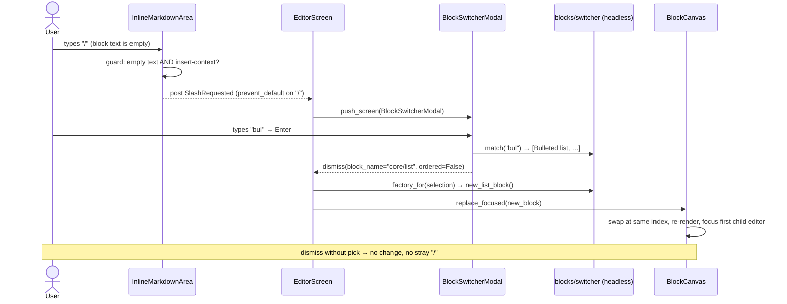

# feat: Slash-command block-type switcher

## Summary

On an **empty** editable block, pressing `/` opens a searchable block-type picker; typing
part of a block's name (e.g. `bulleted list`) and pressing Enter converts that block in
place to the chosen type. This closes the gap identified during testing: the editor can
*edit* an existing `core/list` but has **no way to create one** — the only insertion paths
are `ctrl+n` (paragraph) and `ctrl+g` (image), and typing markdown `- item` in a paragraph
produces `
- item
`, not a native list block.

This is the Phase 4 "block-insertion menu for new text blocks" work, delivered as an
in-context type switcher rather than a separate insert menu.

**Product Contract preservation:** N/A — solo plan (no upstream `ce-brainstorm` contract).

---

## Problem Frame

WordPress models a bulleted list as a distinct `core/list` block wrapping nested
`core/list-item` children — not as markdown inside a paragraph. Today wp-tui can render and
edit a list that already exists in a fetched post (`core/list` is a container the canvas
descends into, `wptui/widgets/canvas.py:32`), but a user starting from a blank post has no
way to produce one. The only block a user can create is an empty paragraph (`ctrl+n`) or an
image (`ctrl+g`).

The desired interaction mirrors the WordPress slash inserter: on an empty block, press `/`,
type the target block's name, and the block becomes that type. Scope is deliberately narrow —
**empty blocks only** — so v1 never has to migrate existing inline content between block
shapes.

---

## Requirements

- **R1** — On an empty editable block, pressing `/` opens the block-type picker instead of
  inserting a literal `/` character.
- **R2** — The picker filters candidate types by typed text against each type's display name
  and aliases (e.g. `bul` / `bulleted list` / `ul` → Bulleted list).
- **R3** — Selecting a type converts the focused empty block to that type **in place** (same
  document position), and all other blocks continue to round-trip byte-for-byte.
- **R4** — Supported target types in v1: Paragraph, Heading (H2), Bulleted list, Numbered
  list, Quote, Code, Preformatted, Separator. (Image stays on `ctrl+g` — it needs a media
  reference the picker can't supply.)
- **R5** — Dismissing the picker without choosing leaves the block an unchanged empty
  paragraph — no stray `/` is left in the text.
- **R6** — Converting to a container type (list, quote) lands focus in the first editable
  child so the user can type the first item/line immediately.
- **R7** — `/` typed in a non-empty block, or anywhere but an empty block, is a literal
  character (no trigger).
- **R8** — The trigger fires only in a text-entry context: when Vim mode is on, `/` triggers
  only in INSERT (it must not shadow a NORMAL-mode `/` search binding).

---

## Key Technical Decisions

- **KTD1 — Modal picker, not an inline caret-anchored dropdown.** Pressing `/` opens a
  centered `ModalScreen` search-and-list picker, reusing the established pattern of
  `wptui/widgets/media_picker.py` and `wptui/widgets/term_picker.py`. Rationale: an inline
  dropdown anchored at the caret would require a new overlay widget and live keystroke
  interception inside `InlineMarkdownArea`, which already overrides several private Textual
  internals (`_build_highlight_map`, `_on_key`, `_on_paste`, `_replace_via_keyboard`) and is
  version-capped `<9` for exactly that reason. The modal reuses tested infrastructure, keeps
  the fragile TextArea subclass untouched beyond a single trigger hook, and still satisfies
  "press `/`, type the name." (User-confirmed.)
- **KTD2 — Empty blocks only; no content migration in v1.** The trigger is gated on the
  block's editable text being empty, so conversion never has to move inline runs between
  incompatible wrappers. Converting a block *with* content is deferred (see Scope Boundaries).
- **KTD3 — Headless block-type registry.** The name→aliases→factory table and the fuzzy
  `match(query)` logic live in `wptui/blocks/switcher.py`, which must not import `textual`
  (per the headless-library rule). This makes matching unit-testable without a terminal and
  keeps the modal a thin view over it.
- **KTD4 — Convert = replace the block object, not mutate it.** Conversion swaps the focused
  block in `BlockCanvas.blocks` for a freshly-minted, already-`dirty` block of the target
  type at the same index. The discarded empty paragraph carried no content. This leverages the
  existing dirty/serialize machinery (`new_*` factories already produce `dirty=True` blocks)
  instead of hand-editing `block_name`/`inner_html`/`inner_content` in place.
- **KTD5 — Trigger via a bubbling `Message`.** `InlineMarkdownArea` detects the empty-block
  `/` and posts a custom message (mirroring the existing `VimCommand` message) that bubbles to
  `EditorScreen`. The screen owns opening the modal and calling `canvas.replace_focused(...)`,
  keeping focus/structural logic centralized in the canvas and out of the text widget.

---

## High-Level Technical Design

The trigger-to-conversion path crosses five components. The sequence:

---

## Implementation Units

### U1. Block factories for the switchable types

**Goal:** Provide `new_*` factories for every non-image target type in R4, each producing
valid, round-trippable WordPress block grammar.

**Requirements:** R3, R4

**Dependencies:** none

**Files:**
- `wptui/blocks/factory.py` (extend)
- `tests/test_factory.py` (new)

**Approach:** Follow the existing `new_paragraph_block()` shape (an already-`dirty` block with
`inner_html` + single-element `inner_content`). Add:
- `new_heading_block(level=2)` — `core/heading`, `attributes={"level": 2}` when not H2 (WP
  omits `level` for the default H2), wrapper `<h2></h2>`.
- `new_list_block(ordered=False)` — `core/list` container with **one empty** `core/list-item`
  child. Match the confirmed fixture grammar: container `inner_html`/`inner_content` wrap
  `<ul>`…`</ul>` (or `<ol>` with `attributes={"ordered": true}`), and the nested list-item is a
  child block (`<li></li>`) spliced via a `None` placeholder in the container's
  `inner_content`. Verify against `tests/test_structural.py` / `tests/test_nested_blocks.py`.
- `new_quote_block()` — `core/quote` containing one empty `core/paragraph` child (WP's shape).
- `new_code_block()` — `core/code`, wrapper `<pre class="wp-block-code"><code></code></pre>`.
- `new_preformatted_block()` — `core/preformatted`, wrapper `<pre class="wp-block-preformatted"></pre>`.
- `new_separator_block()` — `core/separator`, a void/self-closing block; distinct from the
  existing `separator_freeform()` (which is whitespace, not a `core/separator`).

**Patterns to follow:** `new_paragraph_block`, `new_image_block` in `wptui/blocks/factory.py`;
nested-block construction as exercised by `tests/test_nested_blocks.py`.

**Test scenarios:**
- Each factory returns a `dirty=True` block whose `serialize([block])` equals the expected WP
  grammar string (assert exact bytes for paragraph, heading, list, quote, code, preformatted,
  separator).
- `serialize(parse(serialize([block]))) == serialize([block])` for each — the minted block
  survives a parse/serialize round-trip.
- `new_list_block(ordered=True)` emits `<ol` and `{"ordered":true}`; `ordered=False` emits
  `<ul` and no `ordered` attribute.
- `new_heading_block(2)` omits the `level` attribute; `new_heading_block(3)` includes
  `{"level":3}` and an `<h3>` wrapper.
- Each minted list/quote container exposes exactly one editable child via the canvas's
  classification helpers (guards U3's focus behavior).

---

### U2. Headless block-type registry and matcher

**Goal:** A headless table mapping display name + aliases → factory, plus a `match(query)`
filter, usable by the modal without importing `textual`.

**Requirements:** R2, R4

**Dependencies:** U1

**Files:**
- `wptui/blocks/switcher.py` (new)
- `tests/test_block_switcher_registry.py` (new)

**Approach:** Define an ordered list of entries, each `(label, aliases, factory)` — e.g.
`("Bulleted list", {"bulleted list", "unordered list", "ul", "bullets"}, lambda: new_list_block(False))`,
`("Numbered list", {"numbered list", "ordered list", "ol"}, lambda: new_list_block(True))`,
`("Heading", {"heading", "h2", "title"}, lambda: new_heading_block(2))`, and so on for
paragraph/quote/code/preformatted/separator. Provide `match(query: str) -> list[Entry]`:
case-insensitive substring match against label and aliases; empty query returns all entries in
registry order. Keep it dependency-free (no textual, no fuzzy library — substring is enough for
this small fixed set).

**Patterns to follow:** the headless-library rule (`wptui/blocks`, `wptui/inline` never import
textual — see `wptui/blocks/factory.py`'s `TYPE_CHECKING`-only import of `MediaItem`).

**Test scenarios:**
- `match("")` returns all entries in declared order.
- `match("bul")`, `match("bulleted")`, `match("ul")` each return the Bulleted-list entry.
- `match("list")` returns both Bulleted and Numbered, in registry order.
- Matching is case-insensitive (`match("BULLETED")` == `match("bulleted")`).
- `match("nonsense")` returns `[]`.
- Every entry's factory produces a block whose `block_name` is in `EDITABLE_BLOCKS`
  (`wptui/blocks/model.py`).
- Importing `wptui.blocks.switcher` does not import `textual` (guard the headless boundary).

---

### U3. Canvas: replace the focused block in place

**Goal:** `BlockCanvas.replace_focused(new_block)` swaps the focused top-level block for
`new_block` at the same index, re-renders, and focuses the appropriate editor.

**Requirements:** R3, R6

**Dependencies:** U1

**Files:**
- `wptui/widgets/canvas.py` (extend)
- `tests/test_canvas_convert.py` (new)

**Approach:** Mirror `insert_block` / `move_focused` (`wptui/widgets/canvas.py:131`,
`:118`). Resolve the focused owner via `_focused_owner()`; if none, return `False`. `self.sync()`
first, replace `self.blocks[index]` with `new_block`, then `await self._rerender(focus=new_block)`.
Unlike `insert_block`, add no separator — this is a positional replacement. For container targets
(list, quote), ensure focus lands on the first descendant editor rather than the container label;
extend the existing focus-restore path (`_focus_widget_for` / `_scroll_into_view`) so that when the
focus target is a container block, it focuses that block's first rendered child editor.

**Patterns to follow:** `insert_block`, `move_focused`, `delete_focused`, and the
`_focus_widget_for` / `call_after_refresh(self._scroll_into_view, …)` focus-restore machinery in
`wptui/widgets/canvas.py`.

**Test scenarios:**
- Replacing a focused empty paragraph with `new_list_block()` leaves `len(canvas.blocks)`
  unchanged and puts the list at the original index.
- Serializing the canvas after replacement contains the list grammar and preserves every other
  block byte-for-byte (build a 3-block doc, convert the middle one, assert the outer two are
  untouched in the output).
- `replace_focused` with no focused block returns `False` and mutates nothing.
- After converting to a list, the focused widget is the first `core/list-item` editor (R6).
- After converting to a paragraph→heading, the focused widget is the heading's editor.

---

### U4. Block-type picker modal

**Goal:** A `ModalScreen` with a search `Input` and a results list, seeded from the U2 registry;
typing filters, Enter returns the chosen entry to the caller.

**Requirements:** R2, R4, R5

**Dependencies:** U2

**Files:**
- `wptui/widgets/block_switcher.py` (new)
- `tests/test_block_switcher_modal.py` (new)

**Approach:** Model on `wptui/widgets/media_picker.py` and `wptui/widgets/term_picker.py`: a
`ModalScreen` composing a title, a search `Input` (`#switch-search`), and an `OptionList`
(`#switch-list`) populated from `switcher.match("")`. On input change, refilter via `match(value)`.
Enter (or option selection) dismisses with the selected entry (or its `block_name` + factory
handle); Escape dismisses with `None`. The screen is a pure view over U2 — it holds no block
construction logic of its own.

**Patterns to follow:** `MediaPickerModal`, `TermPicker` (search Input + list + dismiss-with-result;
Escape-to-cancel; `#id` conventions).

**Test scenarios:**
- Mounting seeds the list with all registry entries in order.
- Typing `bul` in the search input narrows the list to the Bulleted-list entry.
- Selecting an entry + Enter dismisses with that entry; the callback receives the expected
  block-type identity.
- Escape dismisses with `None` (cancel).
- Empty search restores the full list.

---

### U5. Wire the `/` trigger from the editor into the switcher

**Goal:** Detect `/` on an empty block, open the modal (U4), and convert on selection (U3) — with
correct guards so `/` is otherwise literal.

**Requirements:** R1, R5, R6, R7, R8

**Dependencies:** U3, U4

**Files:**
- `wptui/widgets/inline_area.py` (extend — trigger detection + message)
- `wptui/widgets/text_block.py` (thread the message / expose emptiness if needed)
- `wptui/screens/editor.py` (handle the message, open modal, call `replace_focused`)
- `tests/test_slash_trigger.py` (new)

**Approach:** In `InlineMarkdownArea`, when a `/` key arrives and the current text is empty (and
the context is text-entry — non-vim, or vim INSERT per R8), `prevent_default()`/`stop()` so the
`/` is not inserted, and `post_message` a new `SlashRequested` message (define it alongside the
existing `VimCommand` message class). `EditorScreen` handles `SlashRequested` by pushing the
`BlockSwitcherModal`; on a non-`None` result, it resolves the factory (via U2), mints the block,
and calls `self._canvas.replace_focused(new_block)` inside a worker (mirroring
`action_add_image`, `wptui/screens/editor.py:150`). On `None` (dismiss), do nothing — the block
stays an empty paragraph with no `/` inserted (R5). The focused block that posted the message is
the canvas's focused owner, so no block identity needs to travel in the message.

**Execution note:** Add a failing end-to-end test first — press `/` on a fresh `ctrl+n`
paragraph, drive the modal to "Bulleted list", and assert the canvas serializes a `core/list`.
The `_on_key` / Paste / focus seams in this area have repeatedly hidden bugs behind bare-widget
test harnesses (see the paste-duplication and scroll-into-view fixes), so exercise the real
`EditorScreen` path, not a standalone `InlineMarkdownArea`.

**Patterns to follow:** the `VimCommand` `Message` subclass and `_on_key` interception in
`wptui/widgets/inline_area.py`; `action_add_image`'s `run_worker(self._canvas.insert_block(...))`
in `wptui/screens/editor.py`.

**Test scenarios:**
- Pressing `/` on an empty paragraph opens `BlockSwitcherModal` and does **not** insert `/`
  into the text (R1).
- Full path: `/` → filter `bulleted` → Enter converts the block; the canvas now serializes a
  `core/list` with one `core/list-item`, and focus is in the list-item editor (R3, R6).
- Pressing `/` in a **non-empty** block inserts a literal `/` and opens no modal (R7).
- Dismissing the modal with Escape leaves the block an empty paragraph with no `/` and no
  extra blocks (R5).
- With Vim mode on: `/` in NORMAL mode does **not** open the modal (falls through to the vim
  resolver); `/` in INSERT mode on an empty block does open it (R8).
- Converting to a non-container type (e.g. Heading) focuses that block's own editor.

---

## Scope Boundaries

**In scope:** the `/` trigger on empty editable blocks; a modal type picker over a headless
registry; in-place conversion to the R4 target types; focus handoff into converted containers.

### Deferred to Follow-Up Work
- **Content migration** — converting a block that already has text (e.g. a paragraph with a
  sentence → a list item, or splitting lines into multiple list items). v1 is empty-block-only
  (KTD2).
- **Inline caret-anchored dropdown** — the WordPress-style popup that filters in the text flow,
  as an alternative to the modal (KTD1). Revisit if the modal feels heavy in use.
- **Multi-item list creation from the switcher** — the switcher makes a one-item list; adding
  further items (Enter-to-split a `core/list-item`, Backspace-to-remove an empty item) is
  separate list-item-editing work, not part of this feature.
- **Heading level selection in the picker** — v1 converts to H2; choosing H1–H6 from the picker
  is a later refinement.

### Not in scope (non-goals)
- Converting to opaque/passthrough block types (columns, group, table, embed, etc.) — those have
  no in-TUI editor to land in.
- Inserting an image via the switcher — image creation stays on `ctrl+g` (needs a media pick).

---

## Risks & Dependencies

- **Textual-internal fragility (medium).** The trigger touches `InlineMarkdownArea._on_key`, an
  override of a private Textual seam already capped at `textual<9`. Mitigation: keep the hook
  minimal (detect + post message + `prevent_default`), do all real work in the screen/canvas, and
  cover it with the real-`EditorScreen` E2E test in U5.
- **Container focus handoff (medium).** Landing focus inside a freshly-rendered container (R6)
  depends on the post-recompose focus race the project has already hit (recorded in memory:
  `call_after_refresh` + `scroll_visible`). Mitigation: reuse the existing
  `_focus_widget_for` / `_scroll_into_view` path in U3 rather than inventing new focus timing.
- **List grammar exactness (low).** A minted `core/list` must match WP's byte shape to round-trip.
  Mitigation: U1 asserts exact-bytes serialization against the known-good fixture grammar in
  `tests/test_structural.py`.
- **Vim `/` collision (low).** `/` is a conventional Vim search key. Mitigation: R8 gates the
  trigger to INSERT/non-vim; U5 tests both modes.

---

## Verification

- All new unit tests pass; the full suite stays green (`pytest`).
- Manual: from a blank post, `ctrl+n` → `/` → `bulleted list` → Enter yields an editable
  bulleted list; typing fills the first item; saving round-trips a valid `core/list` visible as a
  real list in WordPress admin, with every pre-existing block byte-identical.
- Headless boundary holds: `wptui/blocks/switcher.py` imports no `textual`.

---

## Sources & Research

- Master architecture plan, Phase 4 (`.claude/plans/resilient-zooming-pelican.md`) — origin of
  the "block-insertion menu for new text blocks" requirement and the editable-block set.
- `wptui/widgets/canvas.py` — container classification (`_CONTAINERS`, `_LEAF_EDITABLE`),
  `insert_block`, `move_focused`, focus-restore machinery.
- `wptui/blocks/factory.py` — existing `new_paragraph_block` / `new_image_block` shape.
- `wptui/widgets/inline_area.py` — `VimCommand` message + `_on_key` interception seam.
- `wptui/widgets/media_picker.py`, `wptui/widgets/term_picker.py` — the ModalScreen search/list
  pattern KTD1 reuses.
- `tests/test_structural.py`, `tests/test_nested_blocks.py` — the exact `core/list` grammar the
  U1 factory must reproduce.
