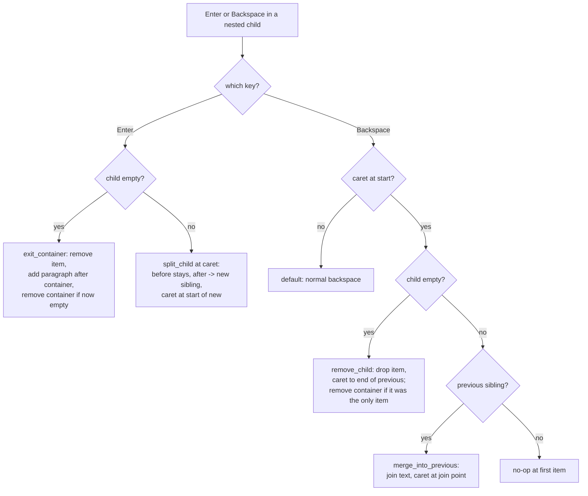
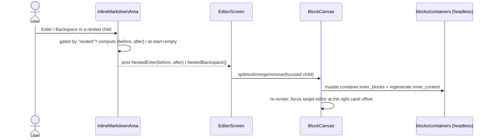

# feat: List-item and quote-paragraph editing (Enter/Backspace)

## Summary

Make the children of `core/list` and `core/quote` editable as a structure: pressing **Enter**
in a `core/list-item` splits it (or adds/exits), and **Backspace** at the start merges or
removes it. This completes the slash-command block switcher — which today mints a **one-item**
list with no way to add a second bullet — and gives quotes the same multi-paragraph editing.

Scope is **full WordPress parity** (user-confirmed): Enter splits at the caret, Backspace at
the start of a non-empty item merges into the previous one — not just the end-of-item /
empty-item cases.

**Product Contract preservation:** N/A — solo plan (no upstream brainstorm).

---

## Problem Frame

`core/list` and `core/quote` render as containers the canvas descends into: each child
(`core/list-item`, or the quote's `core/paragraph`) gets its own inline editor
(`wptui/widgets/canvas.py`, `_CONTAINERS` / `_render_block`). But **Enter and Backspace in a
child today just edit that child's text** — there is no way to add a second list item, split
one, merge two, or leave the list. The `/` switcher can create a list; the user then hits a
dead end at one bullet.

The building blocks already exist: `get_editable_body`/`set_editable_body`
(`wptui/blocks/text.py`) read and write a child's body; the switcher established the pattern of
a widget detecting a key, posting a message, and the canvas mutating the block tree and
restoring focus (`SlashRequested` → `EditorScreen` → `canvas.replace_block`). This feature
applies that same pattern to structural list/quote edits.

---

## Requirements

- **R1** — In a `core/list-item`, **Enter at the end** inserts a new empty item below and puts
  the caret in it.
- **R2** — In a `core/list-item`, **Enter mid-text** splits the item at the caret into two
  items (text before stays; text after moves to a new item below); caret at the start of the
  new item.
- **R3** — On an **empty** `core/list-item`, **Enter** exits the list: the empty item is
  removed, a new `core/paragraph` is inserted **after** the whole list, and the caret lands in
  it. If it was the list's only item, the now-empty list is removed too.
- **R4** — **Backspace at the start of an empty** `core/list-item` removes it and puts the
  caret at the end of the previous item. If it was the only item, the list is removed and focus
  goes to the nearest neighbouring block.
- **R5** — **Backspace at the start of a non-empty** `core/list-item` merges its text into the
  previous item (texts join; caret at the join point). At the first item (no previous sibling)
  it is a no-op.
- **R6** — R1–R5 apply identically to `core/paragraph` children of a `core/quote`. The child
  type differs (paragraph vs list-item) but the operations are the same; **exit always inserts
  a top-level `core/paragraph`** regardless of container type.
- **R7** — These interceptions fire **only** for nested container children. Enter/Backspace in
  a top-level block keep today's behavior (Enter inserts a newline).
- **R8** — An edited container round-trips (it is dirty, so it rebuilds from structure); every
  other block in the document stays byte-identical.

---

## Key Technical Decisions

- **KTD1 — Widget detects, canvas mutates.** `InlineMarkdownArea` intercepts Enter/Backspace,
  computes the caret partition, and posts a message; `EditorScreen` routes it to `BlockCanvas`,
  which owns the tree mutation and focus restore. This mirrors the just-shipped `SlashRequested`
  flow exactly (`wptui/widgets/inline_area.py` → `wptui/screens/editor.py` →
  `wptui/widgets/canvas.py`), keeping the fragile TextArea subclass thin.
- **KTD2 — Regenerate `inner_content`, don't patch it.** When a container's `inner_blocks`
  change, a headless helper rebuilds `inner_content` from scratch (wrapper chunks + one `None`
  placeholder per child) rather than surgically splicing. The edited container is `dirty` and
  rebuilds from structure anyway — the byte-for-byte round-trip guarantee only holds for
  *clean* blocks — so regenerating the interleaving is safe and avoids fragile index math.
  WordPress re-normalizes list whitespace on save regardless.
- **KTD3 — Reuse the `"nested"` signal.** Structural interception is gated to nested children
  via the same `nested` class the `/` guard already reads (`canvas._track` /
  `inline_area._slash_triggers`) — one consistent definition of "is this a container child."
- **KTD4 — Operations are container-generic.** Split/merge/remove/exit take the container and
  child; the child factory (list-item vs paragraph) is chosen from `container.block_name`. Exit
  is the one asymmetry — it always yields a top-level `core/paragraph`.
- **KTD5 — Partition the displayed markdown at the caret.** Split/merge slice the editor's
  markdown text at the caret offset and convert each half back to HTML independently. Splitting
  *inside* an inline marker (e.g. `**bo|ld**`) is a rare, documented edge: the halves are
  serialized leniently by the existing inline engine, not specially repaired in v1.

---

## High-Level Technical Design

Enter/Backspace in a nested child resolve to one of five operations. The decision logic (widget
computes the partition + start/empty flags; canvas picks the op from container state):

Ownership across components (mirrors the `/` switcher):

---

## Implementation Units

### U1. Headless container child-mutation helpers

**Goal:** Headless functions to add/remove/replace a container's children while keeping
`inner_content` valid and round-trippable.

**Requirements:** R2, R3, R4, R5, R6, R8

**Dependencies:** none

**Files:**
- `wptui/blocks/containers.py` (new)
- `wptui/blocks/factory.py` (expose `new_list_item`; add a container→child-factory selector)
- `tests/test_containers.py` (new)

**Approach:** Add `set_container_children(container, children)` that assigns `inner_blocks` and
regenerates `inner_content` as `[open_chunk, *([None] per child), close_chunk]`, preserving the
container's existing wrapper chunks (first/last string entries of the current `inner_content`,
e.g. `\n<ul class="wp-block-list">` … `</ul>\n`), and marks it `dirty` (KTD2). Add
`child_factory_for(container)` returning `new_list_item` for `core/list` and
`new_paragraph_block` for `core/quote`. Promote the existing private `_new_list_item`
(`factory.py`) to a public `new_list_item(body="")`. Reuse `get_editable_body`/
`set_editable_body` (`wptui/blocks/text.py`) for reading/writing a child's body — do not
re-implement wrapper handling.

**Patterns to follow:** `_container_block` / `_leaf_block` in `wptui/blocks/factory.py`;
`serialize`/`_rebuild_inner` interleaving in `wptui/blocks/serialize.py`; the `dirty`-rebuild
contract in `wptui/blocks/model.py`.

**Test scenarios:**
- `set_container_children` on a list with 2 items serializes to valid grammar with both items,
  and `serialize(parse(serialize()))` is stable (round-trip).
- Adding a third child then serializing yields three `<!-- wp:list-item -->` blocks in order.
- Removing the middle of three children leaves the outer two, in order, correct grammar.
- Wrapper is preserved: an `<ol class="wp-block-list">` (ordered) container stays `<ol>` after
  a child change; a `core/quote`'s `<blockquote class="wp-block-quote">` is preserved.
- `child_factory_for` returns a `core/list-item` factory for a list and a `core/paragraph`
  factory for a quote.
- `set_container_children` with a single child matches the exact bytes `new_list_block()` /
  `new_quote_block()` already produce (consistency with the switcher's factories).

---

### U2. Canvas structural operations for nested children

**Goal:** `BlockCanvas` methods that perform split / exit / merge / remove on the focused nested
child, then re-render and place the caret correctly.

**Requirements:** R1, R2, R3, R4, R5, R6, R7, R8

**Dependencies:** U1

**Files:**
- `wptui/widgets/canvas.py` (extend)
- `tests/test_list_edit.py` (new)

**Approach:** Add a `_focused_child()` helper returning `(container, child)` — the focused
`TextBlockEditor`'s `.block` is the child; its `_owner` entry is the top-level container. Then:
- `split_child(before, after)` — `set_editable_body(child, before-as-html)`, build a new child
  (via `child_factory_for`) with `after`, insert it after `child` in the container, re-render,
  focus the new child with caret at offset 0.
- `exit_container()` — remove the empty child; if the container is now childless, remove the
  container from `self.blocks` (identity, via `_index_of`); insert a `new_paragraph_block()` at
  the container's top-level position (after it when the list survives); focus the paragraph.
- `merge_child_into_previous()` — append `child`'s body to the previous sibling's body, remove
  `child`, re-render, focus the previous child with caret at the join offset (length of the
  previous item's original markdown).
- `remove_child()` — remove the empty `child`; focus the previous child's end, or, if it was
  the only child, remove the container and focus the nearest neighbour (reuse
  `_neighbor_content_index`).
Extend the focus path so `_rerender`/`_restore_focus` can place the caret at a given offset
(start, end, or join point) on the focused child's `#body`, not just focus it.

**Execution note:** Add a failing canvas-level test for "second bullet" first (focus a
one-item list, `split_child("", "")`, assert two `core/list-item`s and caret in the new one) —
that is the core outcome the whole feature exists to deliver.

**Patterns to follow:** `replace_block` / `_index_of` / `_focus_widget_for` /
`call_after_refresh(self._scroll_into_view, …)` in `wptui/widgets/canvas.py`; container-child
focus already added there for the switcher.

**Test scenarios:**
- Split a one-item list with `after=""` → two items, caret in the new (second) item (the
  "second bullet" case).
- Split `"onetwo"` at offset 3 → items `"one"` and `"two"`, caret at start of `"two"`.
- Exit from an empty item in a two-item list → item removed, a `core/paragraph` appears after
  the list, list still has one item, caret in the paragraph.
- Exit from an empty **only** item → the list is removed entirely and replaced by a paragraph.
- Merge a non-empty second item into the first → one item whose body is the two joined, caret
  at the join offset; other blocks unchanged.
- Remove an empty second item → back to one item, caret at end of the first.
- Remove an empty only item → list removed, focus on the nearest neighbour block.
- Every operation on a `core/quote` (children are `core/paragraph`) behaves the same; exit
  yields a top-level paragraph.
- After any edit, serializing the document leaves all non-container blocks byte-identical (build
  a paragraph + list + paragraph doc, edit the list, assert the outer two are untouched).

---

### U3. Widget key interception and editor wiring

**Goal:** Intercept Enter/Backspace in a nested child, compute the caret partition, and route to
the U2 canvas ops — with correct gating so top-level blocks are unaffected.

**Requirements:** R1, R2, R3, R4, R5, R6, R7

**Dependencies:** U2

**Files:**
- `wptui/widgets/inline_area.py` (extend — detection + messages)
- `wptui/screens/editor.py` (handle the messages, call the canvas ops)
- `tests/test_nested_enter_backspace.py` (new)

**Approach:** In `InlineMarkdownArea._on_key`, when the editor is a nested child (reuse the
`self.parent.has_class("nested")` check from `_slash_triggers`, KTD3):
- **Enter** (plain, not Shift+Enter): `prevent_default`/`stop`, partition `self.text` at the
  caret's absolute offset into `(before, after)`, post `NestedEnter(before, after)`. Shift+Enter
  falls through to the default soft newline.
- **Backspace** when the caret is at document start (offset 0): `prevent_default`/`stop`, post
  `NestedBackspace()`.
Define both as nested `Message` subclasses next to `SlashRequested`/`VimCommand`. In
`EditorScreen`, add handlers that capture the focused child (canvas resolves container/child)
and dispatch: `NestedEnter` → `exit_container()` when both halves are empty else
`split_child(before, after)`; `NestedBackspace` → `remove_child()` when empty else
`merge_child_into_previous()`. Run mutations in a worker like `_do_convert`. Respect Vim mode:
in NORMAL/VISUAL, Enter/Backspace stay Vim keys (gate to INSERT / non-vim, same shape as the
slash guard).

**Patterns to follow:** `_slash_triggers` + `SlashRequested` post in
`wptui/widgets/inline_area.py`; `on_inline_markdown_area_slash_requested` / `_do_convert` in
`wptui/screens/editor.py`.

**Test scenarios (drive the real `EditorScreen`, per the switcher's proven approach):**
- Enter at the end of a one-item list's item → document now serializes two `core/list-item`s;
  caret in the second (the headline "add a second bullet" E2E).
- Enter mid-text in an item → two items split at the caret.
- Enter on an empty item → a paragraph appears after the list and is focused.
- Backspace at the start of an empty second item → back to one item.
- Backspace at the start of a non-empty second item → merged into the first.
- Backspace at the start of the **first** item → no-op (nothing removed, text intact).
- Enter/Backspace in a top-level paragraph are unaffected (Enter still inserts a newline; the
  document is not restructured) — proves the nested gate (R7).
- The same Enter-to-add and Backspace-to-merge paths work in a `core/quote` paragraph.
- With Vim mode on, Enter in NORMAL mode does not restructure (stays a Vim motion); in INSERT it
  does.

---

## Scope Boundaries

**In scope:** Enter/Backspace structural editing (split, add, exit, merge, remove) for
`core/list-item` and `core/quote` paragraph children, with full-parity caret behavior and
correct focus/caret placement.

### Deferred to Follow-Up Work
- **Tab / Shift+Tab nesting** — indenting a list item into a sublist, or outdenting. This is
  the natural next list feature but is a separate, larger piece (nested `core/list` inside a
  `core/list-item`).
- **Splitting inside an inline marker** cleanly (rebuilding `**bold**` across a split). v1 lets
  the inline engine serialize the halves leniently (KTD5); a rich-model split is a later refinement.
- **Enter-to-split for top-level blocks** (splitting a paragraph into two paragraphs). This
  feature only changes nested-child behavior (R7); block-level split is separate.
- **Soft line breaks** — deciding Shift+Enter semantics inside items beyond "falls through to
  default."

### Not in scope (non-goals)
- Editing children of opaque/passthrough containers (columns, group, table) — those have no
  in-TUI child editors.
- Reordering items by drag or keyboard (the existing `ctrl+up`/`ctrl+down` move top-level
  blocks only).

---

## Risks & Dependencies

- **Caret offset: markdown vs HTML (medium).** Bodies are stored as HTML, edited as markdown.
  Split/merge partition and place the caret in **markdown** space; the join offset for merge is
  the length of the previous item's markdown. Mitigation: do all partition/caret math on the
  displayed markdown text (what the editor holds), convert to HTML only when writing bodies; test
  caret positions explicitly.
- **Splitting inside an inline marker (low).** `**bo|ld**` splits into two invalid-markdown
  halves. Mitigation: KTD5 accepts lenient serialization; a test asserts it does not crash and
  documents the result, rather than special-casing it.
- **Focus/caret after recompose (medium).** Placing the caret in a freshly-rendered child hits
  the same post-recompose timing the project already handles. Mitigation: reuse the existing
  `call_after_refresh` + `_scroll_into_view` path; extend it to also set the caret offset.
- **Container emptied to zero children (low).** A list/quote with no children is invalid grammar.
  Mitigation: exit/remove explicitly remove the container when its last child goes.

---

## Verification

- All new unit tests pass; the full suite stays green (`pytest`).
- Manual: `/` → bulleted list → type an item → Enter → type another → Enter on a blank line to
  exit → save; reopen and confirm a real multi-item `core/list` in WordPress with every other
  block byte-identical. Repeat inside a quote.
- Headless boundary holds: `wptui/blocks/containers.py` imports no `textual`.

---

## Sources & Research

- `wptui/widgets/canvas.py` — `_CONTAINERS`, `_render_block`, `replace_block`, `_index_of`,
  `_focus_widget_for`, focus-restore machinery.
- `wptui/widgets/inline_area.py` — `_slash_triggers` + `SlashRequested`/`VimCommand` message
  pattern this feature mirrors.
- `wptui/blocks/text.py` — `get_editable_body`/`set_editable_body`, reused for child bodies.
- `wptui/blocks/factory.py` — `_container_block`, `_new_list_item`, `new_paragraph_block`.
- `wptui/blocks/serialize.py` — `_rebuild_inner` interleaving that U1 must produce valid input for.
- `docs/plans/2026-07-18-001-feat-slash-block-switcher-plan.md` — the switcher this completes;
  its "Deferred to Follow-Up Work" named exactly this (Enter-to-add-item, Backspace-to-remove).
