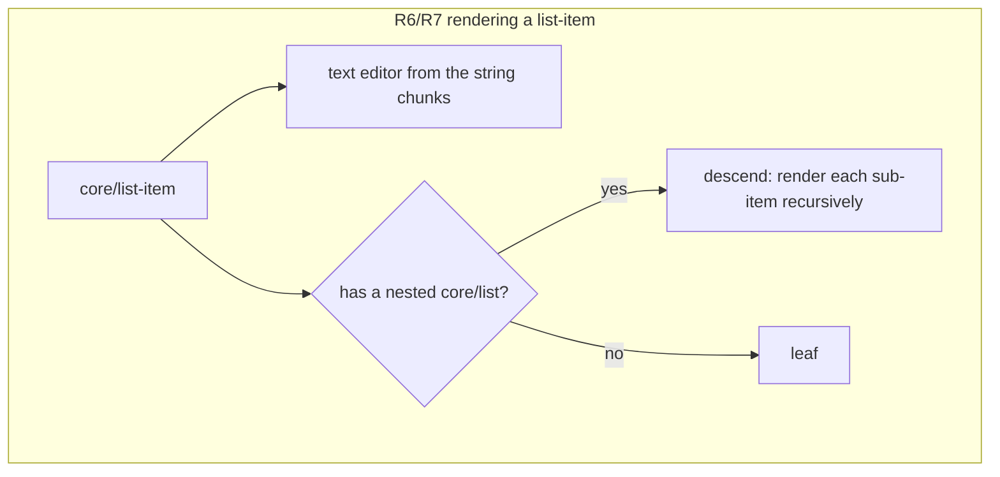
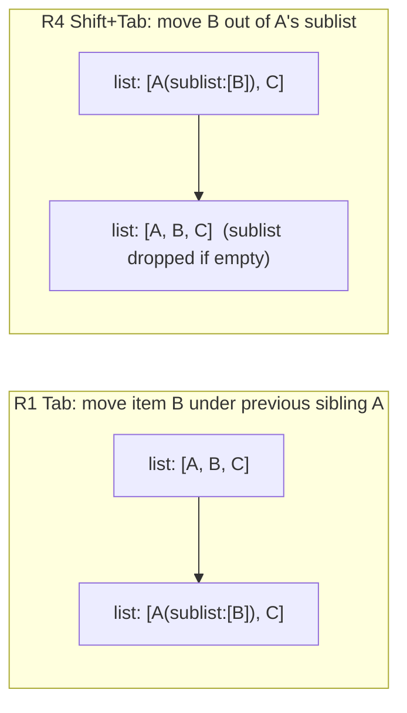
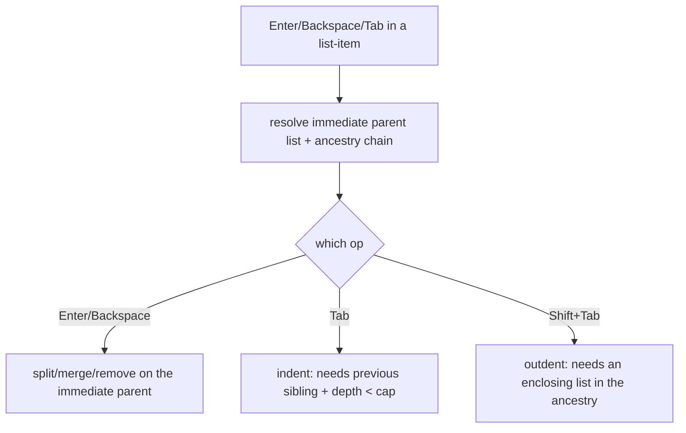

# feat: Tab/Shift+Tab list nesting

## Summary

Let list items nest. **Tab** in a `core/list-item` indents it into a sublist under the
previous item; **Shift+Tab** outdents it back up a level. Nesting is capped at **4 levels**.
Making nested items usable requires two model changes the earlier list work deliberately
deferred: rendering a list-item as **its text editor plus a descent into its nested list**
(today a list-item that contains a sublist renders as an opaque card), and replacing the
depth-1 editing gate with **immediate-parent resolution** so Enter/Backspace/split/merge and
Tab all operate at any nesting depth. That generalization also fixes the currently-dead
Enter/Backspace keys for a list nested inside a quote.

**Product Contract preservation:** N/A — solo plan (no upstream brainstorm).

---

## Problem Frame

The just-shipped list editing (`docs/plans/2026-07-18-002-feat-list-item-editing-plan.md`)
handles a flat list: Enter/Backspace split/merge/remove items, gated to **direct** children
of a top-level container via the `container-child` class (`wptui/widgets/canvas.py` `_track`).
Two facts block nesting:

1. **A list-item with a sublist doesn't render.** `_classify` treats `core/list-item` as a
   leaf editor **only when it has no `inner_blocks`**; a nested `core/list` gives it
   `inner_blocks`, so it currently falls through to an opaque card — the parent text and the
   whole sublist become non-editable.
2. **Editing is depth-1 only.** `_focused_child` resolves the focused editor to its *top-level*
   owner, and structural keys fire only for the `container-child` (depth-1) class. Nested
   items (depth ≥ 2) fall through to default key handling.

WordPress nests a `core/list` **inside** a `core/list-item` (after its text): the parent item
carries both a `<li>` body and a nested list child. So nesting is fundamentally about editing
a list-item that is simultaneously a text block and a container.

---

## Requirements

- **R1** — **Tab** in a list-item indents it: it leaves its current list and becomes the last
  item of a sublist inside the **previous** sibling item (creating that sublist if absent).
  Caret follows the item.
- **R2** — Tab on the **first** item of a list is a no-op (no previous sibling to nest under).
- **R3** — Tab is a no-op when the item is already at nesting depth **4** (the cap).
- **R4** — **Shift+Tab** outdents: the item leaves its sublist and becomes a sibling of its
  parent item in the enclosing list, inserted **after** that parent. If the sublist is left
  empty, it is removed from the parent item.
- **R5** — Shift+Tab on a **top-level** item (no enclosing list) is a no-op.
- **R6** — A list-item that contains a sublist renders as its **text editor** followed by the
  descended sublist (each nested item its own editor), recursively to the cap.
- **R7** — Editing a parent item's **text** (typing, split, merge) preserves its nested
  sublist — the sublist is never dropped by a text commit.
- **R8** — Enter/Backspace structural editing (split, add, exit, merge, remove) works on a
  **nested** item, operating on its **immediate** parent list — including a list nested in a
  quote (currently dead keys).
- **R9** — Every edit round-trips losslessly for untouched blocks; an edited (dirty) list
  rebuilds from structure, nested lists included.
- **R10** — Tab/Shift+Tab fire only for a focused list-item in a text-entry context (not in the
  Vim NORMAL/VISUAL motion layer); Tab does not perform focus traversal while a list-item is
  focused.

---

## Key Technical Decisions

- **KTD1 — Immediate-parent resolution replaces the depth-1 gate.** A new resolver walks the
  block tree to find the container whose `inner_blocks` directly holds the focused child (by
  identity), plus the full ancestry chain (item → sublist → parent item → enclosing list → …).
  All structural ops (split/merge/remove/exit and indent/outdent) key off this immediate
  parent, so they work at any depth. The `container-child` depth-1 class is retired in favor of
  a simpler "is this editor a list-item / quote paragraph" signal that fires at any depth.
  Rationale: one general mechanism is correct at every depth and eliminates the quote>list dead
  keys, versus special-casing each level.
- **KTD2 — A list-item is text + optional sublist; commit preserves the sublist.** Rendering
  descends: a list-item yields its own text editor, then recurses into any nested `core/list`
  in its `inner_blocks`. The text lives in the string chunks of `inner_content` around the
  child-list placeholder; a text commit rewrites only those chunks (via a sublist-aware
  set-body) and never clears `inner_blocks`. Rationale: WordPress's grammar puts the sublist
  inside the `<li>`, so the parent is inherently both — the editor must model that rather than
  treat list-items as leaves.
- **KTD3 — Headless indent/outdent tree transforms.** `wptui/blocks/containers.py` gains pure
  `indent_item` / `outdent_item` functions operating on the ancestry chain: indent removes the
  item from its list and appends it to (or creates) the previous sibling's sublist; outdent
  removes it from its sublist and inserts it after the sublist's owning item in the enclosing
  list, dropping an emptied sublist. Both regenerate `inner_content` via the existing
  `set_container_children`. Rationale: keep the fiddly tree surgery headless and unit-testable,
  matching the split/merge helpers' split of concerns.
- **KTD4 — Depth cap = 4, measured by list ancestry.** An item's nesting depth is its number of
  `core/list` ancestors; Tab is a no-op at depth 4. A single constant in the headless layer.
- **KTD5 — Tab/Shift+Tab intercepted in the list-item editor.** `InlineMarkdownArea` intercepts
  Tab / Shift+Tab (`backtab`) when the focused editor is a list-item, posting `IndentRequested`
  / `OutdentRequested` (mirroring `NestedEnter`); the canvas performs the transform. Tab is
  otherwise Textual focus-traversal, so interception is required. Gated to text-entry context
  like the other structural keys.

---

## High-Level Technical Design

WordPress grammar for a nested list (the parent item holds the sublist after its text):

```text
<!-- wp:list-item -->
<li>parent<!-- wp:list -->
<ul class="wp-block-list"><!-- wp:list-item --><li>child</li><!-- /wp:list-item --></ul>
<!-- /wp:list --></li>
<!-- /wp:list-item -->
```

Parsed: the parent list-item has `inner_content = ["<li>parent", None, "</li>"]` and
`inner_blocks = [nested core/list]`. Rendering and the indent/outdent transforms:





Structural-key resolution changes from "top-level owner" to "immediate parent + ancestry":



---

## Implementation Units

### U1. Render and edit list-items that contain a sublist

**Goal:** A list-item with a nested `core/list` renders as its text editor plus the descended
sublist, and editing its text preserves the sublist.

**Requirements:** R6, R7, R9

**Dependencies:** none

**Files:**
- `wptui/widgets/canvas.py` (`_classify` / `_render_block` descent)
- `wptui/blocks/text.py` or `wptui/blocks/containers.py` (a sublist-preserving text setter)
- `wptui/widgets/text_block.py` (commit path uses the sublist-aware setter for list-items)
- `tests/test_list_nesting_render.py` (new)

**Approach:** Treat a `core/list-item` (and, generally, a container child that itself has
child blocks) as **both** a text editor and a container: `_render_block` yields the item's text
editor, then recurses into its `inner_blocks` (the nested list) at depth+1. `_classify` must no
longer send a list-item with `inner_blocks` to the opaque path. The text of such an item lives
in the non-`None` chunks of `inner_content` bracketing the child-list placeholder; add a setter
that rewrites the leading/trailing text chunks (the `<li>…` prefix and `</li>` suffix) **without
touching `inner_blocks` or the placeholder** — unlike `set_editable_body`, which clears
`inner_blocks`. `TextBlockEditor.commit` routes list-items with a sublist through this setter.

**Patterns to follow:** container descent in `_render_block` / `_CONTAINERS`
(`wptui/widgets/canvas.py`); `split_wrapper` / `set_editable_body` in `wptui/blocks/text.py`;
`_rebuild_inner`'s `None`-placeholder interleaving in `wptui/blocks/serialize.py`.

**Test scenarios:**
- A doc with a parent item + a two-item sublist renders 3 text editors (parent, child1, child2)
  in order, all editable.
- Editing the parent item's text and serializing preserves the nested list intact (both sub-items
  still present).
- A parent item with a sublist round-trips (`serialize(parse(serialize(doc))) == …`).
- Splitting/merging a parent item's text (existing Enter/Backspace) keeps its sublist attached to
  the correct resulting item.
- A plain leaf list-item (no sublist) still renders and edits exactly as before (regression).

---

### U2. Immediate-parent resolution for structural editing at any depth

**Goal:** Enter/Backspace structural editing operates on the focused item's immediate parent
container, at any nesting depth — replacing the depth-1 `container-child` gate.

**Requirements:** R8, R9

**Dependencies:** U1

**Files:**
- `wptui/widgets/canvas.py` (`_focused_child` → immediate-parent + ancestry resolver; the
  split/merge/remove/exit ops use it)
- `wptui/widgets/inline_area.py` (`_is_container_child` fires for any list-item / quote child,
  not just depth-1)
- `tests/test_list_edit.py` (extend), `tests/test_nested_enter_backspace.py` (extend)

**Approach:** Replace `_focused_child` (top-level owner) with a resolver that walks `self.blocks`
to find the container directly holding the focused child by identity, returning
`(immediate_container, child)` plus the ancestry chain for U3. The split/merge/remove ops already
call `_locate_focused_child`; point it at the new resolver so they mutate the immediate parent.
`exit_container` on a **nested** empty item means outdent (defer to U3's outdent) rather than
inserting a top-level paragraph; on a **top-level** empty item it keeps today's behavior. Retire
the depth-1 `container-child` class in favor of a signal that marks every list-item / quote-child
editor (the canvas knows the block type at render time).

**Execution note:** Add a failing test first for the quote>list dead-key case (Enter in a list
nested in a quote should split), which the depth-1 gate currently drops — it proves the
generalization end-to-end.

**Patterns to follow:** `_focused_child` / `_locate_focused_child` / `_identity_index` in
`wptui/widgets/canvas.py`; the `container-child` gating in `wptui/widgets/inline_area.py`.

**Test scenarios:**
- Enter at the end of a nested (depth-2) list-item adds a sibling in the **same** sublist.
- Backspace at the start of an empty nested item removes it from its sublist (and drops the
  sublist if it was the only child).
- Merge/split behave correctly on depth-2 and depth-3 items (operate on the immediate parent).
- Enter in a list nested inside a quote splits the item (the previously-dead-key case).
- Top-level list editing is unchanged (regression across the existing list-edit suite).

---

### U3. Tab / Shift+Tab indent and outdent

**Goal:** Tab indents a list-item into the previous sibling's sublist (capped at depth 4);
Shift+Tab outdents it to the enclosing list.

**Requirements:** R1, R2, R3, R4, R5, R9, R10

**Dependencies:** U1, U2

**Files:**
- `wptui/blocks/containers.py` (headless `indent_item` / `outdent_item`, a depth helper, and the
  `MAX_LIST_NEST_DEPTH` constant)
- `wptui/widgets/canvas.py` (`indent_focused` / `outdent_focused` using the ancestry resolver)
- `wptui/widgets/inline_area.py` (`IndentRequested` / `OutdentRequested` messages + Tab/backtab
  interception for list-items)
- `wptui/screens/editor.py` (message handlers → canvas ops)
- `tests/test_list_nesting.py` (new)

**Approach:** Headless `indent_item(enclosing_list, item)` — find the item's index, take the
previous sibling item, attach the item to that sibling's sublist (append if present, else create
a `core/list` matching the enclosing list's ordered/tag via `set_container_children`), and remove
it from the enclosing list. `outdent_item(chain)` — remove the item from its sublist, insert it
into the enclosing list immediately after the sublist's owning item, and drop the sublist if now
empty. A `list_depth(chain)` helper counts `core/list` ancestors; indent no-ops at
`MAX_LIST_NEST_DEPTH`. The canvas resolves the ancestry (U2), applies the transform, re-renders,
and refocuses the moved item. `InlineMarkdownArea` intercepts `tab` / `shift+tab` (backtab) when
`_is_container_child` (a list-item) and in text-entry context, posting the messages; `EditorScreen`
routes them. Tab interception must `prevent_default` so Textual doesn't focus-traverse.

**Patterns to follow:** `set_container_children` / `child_factory_for` in
`wptui/blocks/containers.py`; the `NestedEnter` message + `_nested_structural_key` +
`on_inline_markdown_area_nested_enter` flow across `wptui/widgets/inline_area.py`,
`wptui/screens/editor.py`, `wptui/widgets/canvas.py`.

**Test scenarios:**
- **Headless:** indent item 2 of `[a, b, c]` → `[a(sublist:[b]), c]`; serialized grammar has the
  nested `<ul>` inside item a's `<li>`, and round-trips.
- **Headless:** indent a second item under the same parent appends to the existing sublist
  (`a(sublist:[b, d])`), not a new sublist.
- **Headless:** outdent `b` from `a(sublist:[b])` → `[a, b]` with the emptied sublist removed;
  outdent with following siblings keeps them in the sublist.
- **Headless:** `indent_item` on the first item is a no-op; `list_depth` at the cap blocks indent;
  `outdent_item` at top level is a no-op.
- **E2E:** Tab on a focused non-first item nests it (renders under the previous item); Shift+Tab
  brings it back; caret follows the moved item.
- **E2E:** Tab on the first item and Tab at depth 4 do nothing; Shift+Tab on a top-level item does
  nothing.
- **E2E:** Tab does not move focus away (interception works); in Vim NORMAL, Tab is not an indent.
- Other blocks stay byte-identical after an indent/outdent (build a paragraph + list + paragraph
  doc, nest within the list, assert the outer two unchanged).

---

## Scope Boundaries

**In scope:** Tab/Shift+Tab indent/outdent for list items (ordered and unordered), nested-list
rendering and editing to a depth-4 cap, immediate-parent resolution generalizing the existing
structural editing.

### Deferred to Follow-Up Work
- **Mixed / ordered-unordered sublists chosen per-indent** — a sublist inherits the enclosing
  list's ordered/unordered kind; letting the user pick a different kind for a sublist is separate.
- **Moving an item with its own sublist** — indent/outdent move a single item; carrying a whole
  subtree is a later refinement (initial version may leave a moved item's sublist behind or move
  it as a unit — resolve in implementation and document the choice).
- **Reordering across levels** (Ctrl+Up/Down currently moves top-level blocks only).

### Not in scope (non-goals)
- Nesting non-list blocks (paragraphs, headings) inside list items.
- Nesting inside opaque containers (columns, group) that have no in-TUI child editors.

---

## Risks & Dependencies

- **List-item-as-text-plus-container model (high).** U1 changes a core assumption (list-items
  were leaves). The commit path must never wipe a sublist. Mitigation: a dedicated
  sublist-preserving text setter with a direct round-trip test (edit parent text → sublist
  intact); keep leaf list-items on the existing path (regression test).
- **Ancestry resolution correctness (medium).** Indent/outdent need the full chain
  (item → sublist → parent item → enclosing list). A wrong link corrupts structure. Mitigation:
  headless `indent_item`/`outdent_item` unit-tested on block trees before any widget wiring.
- **Moved-item's own sublist (medium).** Indenting/outdenting an item that itself has a sublist
  is ambiguous; the plan defers the "carry the subtree" behavior — implementation must pick a
  defined, tested behavior (move as a unit, or refuse) rather than corrupt the tree.
- **Focus/caret after recompose (medium).** Reuse the existing `call_after_refresh` +
  `_settle_focus` caret path; the moved item is re-resolved by identity.
- **Tab focus-traversal (low).** Interception must `prevent_default`; covered by an E2E test.

---

## Verification

- New unit + E2E tests pass; the full suite stays green (`pytest`).
- Manual: create a bulleted list, type items, Tab to nest, Shift+Tab to unnest, edit nested item
  text and split/merge within a sublist; save and confirm a correct nested `core/list` in
  WordPress with untouched blocks byte-identical.
- Headless boundary holds: `wptui/blocks/containers.py` (indent/outdent) imports no `textual`.

---

## Sources & Research

- `docs/plans/2026-07-18-002-feat-list-item-editing-plan.md` — the flat list editing this extends;
  its "Deferred to Follow-Up Work" named Tab/Shift+Tab nesting.
- `wptui/widgets/canvas.py` — `_render_block` / `_classify` descent, `_focused_child` /
  `_locate_focused_child`, `container-child` gating, the split/merge/remove ops.
- `wptui/blocks/containers.py` — `set_container_children` / `child_factory_for` this extends.
- `wptui/blocks/text.py` — `split_wrapper` / `set_editable_body`, and why a sublist-preserving
  variant is needed.
- `wptui/widgets/inline_area.py` — the `NestedEnter`/`_nested_structural_key` interception pattern
  Tab/Shift+Tab mirror.
- `tests/fixtures/kitchen_sink.html` — real nested-block grammar for round-trip fixtures.
