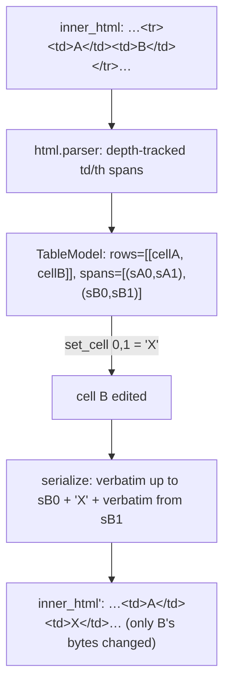
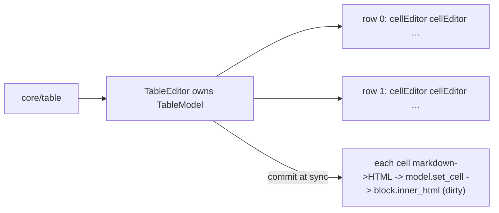

# feat: Editable table cells

## Summary

Make `core/table` blocks editable — today they render as an opaque passthrough card. v1
renders a table as a focusable grid of per-cell inline editors; typing edits a cell's text
through the existing markdown↔HTML engine (so bold/links work in cells). Everything the user
doesn't touch — the table's rows/columns, `thead`/`tbody`/`tfoot`, alignment classes,
`colspan`/`rowspan`, and `figcaption` — round-trips byte-for-byte.

The enabling idea: a headless table model that parses the cell grid but rebuilds by
**replacing only edited cell contents**, leaving all surrounding HTML verbatim. Losslessness
and structure-preservation fall out for free — we never reconstruct the table, only splice
cell text.

**Product Contract preservation:** N/A — solo plan (no upstream brainstorm).

---

## Problem Frame

A WordPress table is `core/table` wrapping HTML with no child blocks:
`<figure class="wp-block-table"><table><thead?><tbody><tr><td>cell</td>…</tr>…</tbody>
<tfoot?></table><figcaption?></figure>`. The canvas classifies it as **opaque**
(`_classify` in `wptui/widgets/canvas.py`) and renders an `OpaqueCard` — preserved but not
editable. The cell text is all in the block's `inner_html`; editing it means parsing the grid
out of that HTML and writing edited cells back without disturbing anything else.

The project's round-trip discipline (stdlib `html.parser`, no BeautifulSoup/lxml, which reflow
HTML) and the "only rebuild dirty blocks from structure" invariant shape the approach. The
closest existing analog is `wptui/blocks/image.py` — a semi-structured block whose edits
preserve surrounding attributes with targeted, regex/parser-scoped rewrites.

---

## Requirements

- **R1** — A `core/table` block renders as a grid of per-cell editors (one per `<td>`/`<th>`),
  each focusable and navigable; the grid stays legible in the terminal.
- **R2** — Typing in a cell edits that cell's text; inline formatting (`**bold**`,
  `[link](url)`) works via the existing markdown↔HTML engine.
- **R3** — Editing a cell changes **only** that cell's content in the serialized output; every
  other cell, all table structure (`thead`/`tbody`/`tfoot`, row/column layout,
  `colspan`/`rowspan`), all element attributes (alignment classes, etc.), and the `figcaption`
  are byte-identical.
- **R4** — An untouched table round-trips losslessly (`serialize(parse(x)) == x`), and a table
  whose one cell was edited differs only in that cell's bytes.
- **R5** — The grid parse / cell get-set / serialize is a **headless** model (no `textual`
  import), unit-testable without a terminal, using stdlib `html.parser`.
- **R6** — Header cells (`<th>`) and body cells (`<td>`) are both editable; a table with a
  `thead` and a `tfoot` edits cells in any section.

---

## Key Technical Decisions

- **KTD1 — Offset-splice model, not reconstruction.** The headless model parses the table's
  `inner_html` once, recording each cell's **content span** (the character range between its
  `<td…>`/`<th…>` and matching close tag). Serialization walks the original string and replaces
  only edited spans; unedited spans and everything between them (tags, attributes, whitespace,
  `figcaption`) are emitted verbatim. This makes R3/R4 structural — we never rebuild the table,
  so `colspan`/`thead`/alignment can't drift. Rationale: reconstruction would have to perfectly
  reproduce WordPress's exact HTML; splicing sidesteps that entirely.
- **KTD2 — `html.parser` with tag-depth tracking for cell boundaries.** A stdlib
  `HTMLParser` subclass walks `inner_html`, opening a cell on `<td>`/`<th>` and closing it on
  the matching `</td>`/`</th>`, tracking depth so a nested tag inside a cell (`<strong>`, or a
  rare nested table) doesn't close the wrong cell. It records content-span offsets via the
  parser's position API. Rationale: stdlib-only, no reflow, matches `inline/html_parse.py`.
- **KTD3 — Cell text is HTML, edited as markdown — reuse the inline engine.** Each cell editor
  seeds from the cell's HTML content via `html_to_markdown` and commits via `markdown_to_html`
  (the shared wrappers in `wptui/inline`), exactly like `TextBlockEditor`. Rationale: one
  formatting engine; cells get bold/links for free.
- **KTD4 — New `table` classification + `TableEditor` widget.** `_classify` returns `"table"`
  for `core/table`; `_render_block` yields a `TableEditor` that owns the `TableModel` and a grid
  of cell editors, with a `commit()` that writes edited cells back and updates the block's
  `inner_html` (dirty). Rationale: mirrors the `TextBlockEditor`/`ImageCard` widget+commit
  pattern the canvas already drives via `sync()`.
- **KTD5 — Cell editors are the existing `InlineMarkdownArea`.** Reuse it (single-line-ish,
  live-styled) per cell rather than a new widget. Rationale: consistent editing, less surface.

---

## High-Level Technical Design

The model records cell content spans against the original `inner_html`; serialize splices:

Rendering + commit mirror the existing text-block flow, one editor per cell:

---

## Implementation Units

### U1. Headless table model (parse / edit / serialize)

**Goal:** A headless `TableModel` that parses a table's `inner_html` into a cell grid, edits a
cell's content, and serializes back with only edited cells changed.

**Requirements:** R3, R4, R5, R6

**Dependencies:** none

**Files:**
- `wptui/blocks/table.py` (new)
- `tests/test_table_model.py` (new)

**Approach:** An `HTMLParser` subclass records each `<td>`/`<th>`'s content span — the offset
just after the opening tag to the offset of its matching close — tracking open-tag depth so
nested inline tags (and rare nested tables) don't mis-close. Build `TableModel` holding the
original `inner_html`, an ordered list of cells (each: section context is irrelevant to
editing; store `tag`, content string, and `(start, end)` span), and a row/col shape for the
grid (rows delimited by `<tr>`). `cell(r, c)` / `set_cell(r, c, html)` address by grid
position; `serialize()` rebuilds by emitting `inner_html` verbatim except each edited cell's
span, replaced with its new content. Do **not** normalize or re-emit any tag/attribute.

**Execution note:** Start from a golden round-trip test on the real fixture table
(`tests/fixtures/kitchen_sink.html`) — `serialize(parse(x)) == x` before touching edit logic.

**Patterns to follow:** `wptui/inline/html_parse.py` (stdlib `HTMLParser` usage);
`wptui/blocks/image.py` (attribute-preserving targeted edits); the `original_raw`/span-capture
discipline in `wptui/blocks/grammar.py`.

**Test scenarios:**
- Parse a 2×2 table → `rows` is a 2×2 grid with the right cell texts; `serialize()` equals the
  input byte-for-byte.
- `set_cell(0,1,"<strong>X</strong>")` then `serialize()` changes only that cell; the other
  three cells, `<tr>`/`<td>` tags, and any `class`/alignment attributes are unchanged.
- A table with a `thead` **and** `tbody` **and** `tfoot`: cells in each section are addressable
  and editable; sections and the header/footer rows are preserved.
- A table with `colspan`/`rowspan` on some cells round-trips and edits an unrelated cell without
  disturbing the span attributes.
- A cell containing inline formatting (`<a href>`, `<strong>`) is read as its HTML content and
  re-spliced unchanged when a *different* cell is edited.
- A `figcaption` after the table is preserved verbatim through an edit.
- Edge: an empty cell (`<td></td>`) is addressable and can be given content.

---

### U2. TableEditor widget (grid of cell editors)

**Goal:** A Textual widget that renders a `TableModel` as rows of focusable cell editors and
commits edits back into the model.

**Requirements:** R1, R2, R6

**Dependencies:** U1

**Files:**
- `wptui/widgets/table_editor.py` (new)
- `wptui/app.tcss` (grid/cell styling)
- `tests/test_table_editor.py` (new)

**Approach:** `TableEditor` parses the block's `inner_html` into a `TableModel` on init, and
composes one horizontal row of cell editors per table row (each cell an `InlineMarkdownArea`
seeded via `html_to_markdown` of the cell's content). Give cells a bounded width so the grid
stays legible; header-row cells may be visually distinguished. `commit()` reads each cell
editor's markdown, converts via `markdown_to_html`, calls `model.set_cell`, and — if anything
changed — writes `model.serialize()` back to `block.inner_html`/`inner_content` and marks the
block dirty (mirroring `TextBlockEditor.commit`). Expose the same `commit()` contract the canvas
`sync()` loop calls.

**Patterns to follow:** `wptui/widgets/text_block.py` (`TextBlockEditor` compose + `commit`);
`wptui/widgets/inline_area.py` (`InlineMarkdownArea`); `wptui/inline` `html_to_markdown` /
`markdown_to_html`; `MediaPickerModal`'s `DEFAULT_CSS`-for-test-harness approach.

**Test scenarios:**
- A 2×2 table renders 4 cell editors seeded with the right (markdown) text.
- Editing a cell editor's text then `commit()` updates the block's `inner_html` with the new
  cell content and marks it dirty; other cells unchanged.
- A cell with `<strong>bold</strong>` seeds as `**bold**` and commits back to `<strong>` HTML.
- `commit()` with no edits leaves the block clean (not dirtied) and byte-identical.
- Header (`<th>`) cells are rendered and editable alongside `<td>` cells.

---

### U3. Canvas classification and wiring

**Goal:** The canvas classifies `core/table` as a table and renders/commits it through the
`TableEditor`.

**Requirements:** R1, R3, R4

**Dependencies:** U2

**Files:**
- `wptui/widgets/canvas.py` (`_classify` + `_render_block`)
- `tests/test_table_edit_e2e.py` (new)

**Approach:** Add a `"table"` branch to `_classify` (before the opaque fallback) for
`core/table`, and a `_render_block` branch yielding a `TableEditor` tracked like other editors
(added to `self._editors` so `sync()` commits it). No changes to the structural-op paths —
tables are top-level, non-container leaves for those purposes.

**Patterns to follow:** the `_classify`/`_render_block`/`_track`/`_editors` flow in
`wptui/widgets/canvas.py`; how `ImageCard` is classified and committed.

**Test scenarios:**
- A document with a table renders a `TableEditor` (not an `OpaqueCard`).
- End-to-end: focus a cell, change its text, `sync()`/serialize the document → the table's cell
  updated, and a paragraph before and after the table are byte-identical.
- A table the user never focuses serializes byte-identical to the source (via the canvas).
- Regression: paragraphs, lists, images, and genuinely opaque blocks (columns, group) still
  classify and render as before.

---

## Scope Boundaries

**In scope:** rendering a table as an editable cell grid; editing existing cell text with inline
formatting; lossless preservation of all structure/attributes/caption.

### Deferred to Follow-Up Work
- **Structural grid ops** — add/remove row, add/remove column (keeping every row's column count
  and the header consistent). The headless `TableModel` is the intended foundation; this is the
  natural next feature.
- **Editing the `figcaption`** as a caption field (v1 preserves it verbatim but doesn't edit it).
- **Cell alignment / header toggles** (changing a cell's `class`/`th`↔`td`) — attribute edits
  beyond text.

### Not in scope (non-goals)
- Nested block content inside cells (WordPress cells are inline HTML, not blocks).
- Reflowing or re-emitting the table HTML — the model only splices cell content.

---

## Risks & Dependencies

- **Cell-boundary parsing with nesting (high).** A cell containing nested tags — or a rare
  nested table — must close on the *matching* `</td>`/`</th>`, not the first. Mitigation:
  depth-tracked `HTMLParser`; tests with `<strong>`/`<a>` in cells and a golden round-trip on the
  real fixture; if a truly nested table is encountered, it is acceptable to treat the outer cell
  as verbatim/uneditable rather than mis-parse — document the choice.
- **Grid legibility/focus in the terminal (medium).** A wide table of editors can overflow or
  be hard to navigate. Mitigation: bounded cell widths, horizontal scroll on the row container,
  and reuse the canvas's existing focus/scroll-into-view machinery; verify at a small terminal
  size in a test harness.
- **Offset invalidation across multiple edits (medium).** Editing several cells must not corrupt
  spans as the string changes. Mitigation: serialize from the *original* `inner_html` + the set
  of edited contents in one pass (spans index the original, never a mutated string), so multiple
  edits compose correctly.
- **`html.parser` position API precision (low).** Content-span offsets must land exactly at
  tag boundaries. Mitigation: golden byte-for-byte round-trip test gates correctness.

---

## Verification

- New unit + E2E tests pass; the full suite stays green (`pytest`).
- Manual: open a post with a table, edit a couple of cells (including one with a link), save;
  confirm in WordPress that only those cells changed and the table structure/caption is intact;
  reopen to confirm the round trip.
- Headless boundary holds: `wptui/blocks/table.py` imports no `textual`.

---

## Sources & Research

- `wptui/widgets/canvas.py` — `_classify` (`"opaque"` path for tables today), `_render_block`,
  `_editors`/`sync` commit loop.
- `wptui/blocks/image.py` — the attribute-preserving semi-structured-block edit pattern.
- `wptui/inline/html_parse.py` — stdlib `HTMLParser` usage to mirror.
- `wptui/widgets/text_block.py` / `wptui/widgets/inline_area.py` — the editor + `commit()` +
  `html_to_markdown`/`markdown_to_html` pattern cells reuse.
- `tests/fixtures/kitchen_sink.html`, `tests/test_structural.py` (the `TABLE` fixture) — real
  table grammar for golden round-trip tests.
