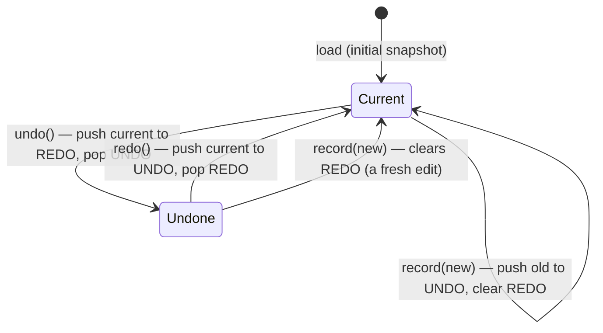
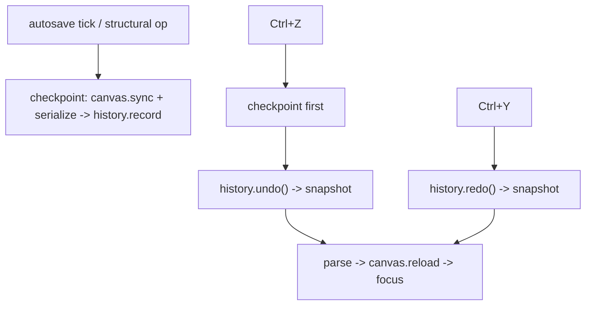

# feat: Document undo/redo

## Summary

Add document-level **Undo (Ctrl+Z)** and **Redo (Ctrl+Y)** to the editor. Undo/redo operate on
**coarse whole-document snapshots** (the serialized block grammar): every structural
operation and every flushed batch of text edits produces a snapshot, and undo restores the
previous whole-document state. One consistent model — Ctrl+Z is the document undo everywhere,
replacing Textual's per-widget TextArea undo so there's a single, predictable behavior.

The snapshot cadence reuses machinery that already exists: the editor's autosave tick already
`sync()`s the editors and serializes the document — undo just records those snapshots, and each
structural op and the undo/redo actions themselves force a checkpoint so the latest change is
always captured before an undo.

**Product Contract preservation:** N/A — solo plan.

---

## Problem Frame

The editor has no undo. A structural mistake (delete the wrong block, a bad split/merge, an
unwanted heading-level change) or a text edit can't be reversed except by hand. The document is
a list of blocks (`BlockCanvas.blocks`) that serializes losslessly to block grammar; edits flow
into the blocks via `sync()` (called on save, on the autosave tick, and before every structural
op). So a robust undo can snapshot the **serialized document string** at edit boundaries and
restore by re-parsing — decoupled from live block-object identity, and lossless by construction.

Textual's `TextArea` has its own per-widget `ctrl+z` undo (intra-cell). Two undo systems would
be confusing; the user chose one coarse whole-document model, so document Ctrl+Z takes over
(priority binding), and per-widget text undo is not relied upon.

---

## Requirements

- **R1** — **Ctrl+Z** restores the document to its previous snapshot; **Ctrl+Y** re-applies an
  undone snapshot. Both work while a cell/block editor is focused (document-level, not the
  TextArea's per-widget undo).
- **R2** — A snapshot is the serialized block-grammar document; restoring re-parses it and
  re-renders the canvas, then places focus in a sensible block.
- **R3** — Undo covers **structural** changes (insert, delete, move, convert via `/`, split,
  merge, remove, indent/outdent, heading-level, image insert, table cell edits) **and text**
  edits (captured at the autosave cadence and forced before any undo).
- **R4** — Coarse granularity is acceptable: a burst of edits between checkpoints may undo as
  one step. Redo is available until a new edit is made (which clears the redo stack).
- **R5** — Undo at the oldest state and redo at the newest are safe no-ops. Restoring never
  corrupts the document — an untouched, then undone-to, document round-trips losslessly.
- **R6** — Undo/redo are document-content only; post title and settings are out of scope.

---

## Key Technical Decisions

- **KTD1 — Snapshots are serialized strings, restored by re-parse.** `DocumentHistory` holds
  the current snapshot plus undo/redo stacks of block-grammar strings. Restoring `parse()`s the
  string into fresh blocks and reloads the canvas. Rationale: lossless, decoupled from live
  block identity, trivially comparable for dedup.
- **KTD2 — Checkpoint = sync + serialize + record.** A checkpoint flushes editors (`sync()`),
  serializes, and records the snapshot only if it differs from the current one. The **autosave
  tick** (already syncs+serializes) records on its interval — capturing text edits for free —
  and the undo/redo actions force a checkpoint first so the just-made change is on the stack
  before restoring. Rationale: reuse the existing cadence; no per-editor wiring.
- **KTD3 — Ctrl+Z/Ctrl+Y as priority screen bindings.** `EditorScreen` binds them `priority=True`
  (like `ctrl+e`/`ctrl+n`) so they preempt the focused TextArea's own `ctrl+z`. Rationale: one
  consistent document-level undo model per the chosen scope.
- **KTD4 — `record` clears redo; undo/redo move between stacks.** Standard undo semantics: a new
  recorded snapshot invalidates the redo future. Rationale: matches user expectation.
- **KTD5 — `BlockCanvas.reload(blocks)` replaces the document in place.** A canvas method swaps
  `self.blocks` and recomposes, then focus is restored to the first editor. Rationale: one clear
  entry point for a full-document swap, mirroring the existing `_rerender` recompose.

---

## High-Level Technical Design

The history is a current snapshot plus two stacks; checkpoints record, actions move:

Checkpoint and restore flow across components:

---

## Implementation Units

### U1. DocumentHistory

**Goal:** A pure undo/redo history over serialized-document snapshots.

**Requirements:** R2, R4, R5

**Dependencies:** none

**Files:**
- `wptui/history.py` (new)
- `tests/test_history.py` (new)

**Approach:** A `DocumentHistory` holding `_current: str`, `_undo: list[str]`, `_redo: list[str]`.
`record(snapshot)`: if it differs from `_current`, push `_current` onto `_undo`, set
`_current = snapshot`, clear `_redo`. `undo() -> str | None`: if `_undo` non-empty, push
`_current` onto `_redo`, pop `_undo` into `_current`, return it; else `None`. `redo()`:
symmetric. Optionally cap stack depth (e.g. a few hundred) to bound memory. No `textual` import.

**Test scenarios:**
- Record A, B, C → undo returns B then A; redo returns B then C.
- `record` with an unchanged snapshot is a no-op (no duplicate on the stack).
- A new `record` after an undo clears the redo stack (redo then returns `None`).
- Undo at the oldest state returns `None`; redo at the newest returns `None`.
- Depth cap (if implemented): recording past the cap drops the oldest, and undo still returns
  the most recent within the cap.

---

### U2. Editor wiring: checkpoints, restore, and bindings

**Goal:** Wire `DocumentHistory` into the editor — checkpoint at the autosave cadence and on
structural ops, restore on Ctrl+Z/Ctrl+Y, and reload the canvas from a snapshot.

**Requirements:** R1, R2, R3, R5, R6

**Dependencies:** U1

**Files:**
- `wptui/screens/editor.py` (history field, `_checkpoint`, `action_undo`/`action_redo`,
  bindings, autosave-tick hook)
- `wptui/widgets/canvas.py` (`reload(blocks)` method)
- `tests/test_undo_redo.py` (new)

**Approach:** On load, initialize `self._history = DocumentHistory(initial_serialized_content)`.
Add `_checkpoint()` = `sync()` + `serialize()` + `history.record(...)`, and call it from the
existing `_autosave_tick` (right after it already serializes) so text edits are captured on the
interval. `action_undo`: `_checkpoint()` first (so the current change is recorded), then
`history.undo()`; if it returns a snapshot, `parse()` it and call `canvas.reload(...)`, focusing
the first editor. `action_redo`: `history.redo()` then reload (no pre-checkpoint — a redo has no
intervening edit). Add `Binding("ctrl+z", "undo", "Undo", priority=True)` and
`Binding("ctrl+y", "redo", "Redo", priority=True)`. `BlockCanvas.reload(blocks)` sets
`self.blocks` and `await self.recompose()`, then focuses the first editable widget. Structural
ops need no per-op wiring beyond the autosave tick and the undo-time checkpoint, but consider a
lightweight checkpoint after a structural action for snappier granularity (optional; the
autosave tick + undo-time checkpoint already make every structural change recoverable).

**Execution note:** Add a failing E2E first — delete a block, Ctrl+Z, assert the block is back —
before wiring, so the restore path is proven end to end.

**Patterns to follow:** the priority `Binding` + `action_*` pattern in `wptui/screens/editor.py`
(`ctrl+e`/`ctrl+n`); `_autosave_tick`'s existing `sync()`+`serialize()`; `parse`/`serialize`
from `wptui/blocks`; the recompose/focus machinery in `wptui/widgets/canvas.py`.

**Test scenarios:**
- Delete a block, Ctrl+Z → the block is restored (document serializes back to the pre-delete
  state); Ctrl+Y → deleted again.
- Type into a paragraph, force a checkpoint (autosave tick), edit again, Ctrl+Z → the first
  edit's text is restored.
- A structural op (e.g. convert a paragraph to a heading) then Ctrl+Z restores the paragraph.
- Ctrl+Z with no history is a no-op (document unchanged, no crash).
- Ctrl+Y with nothing to redo is a no-op.
- After an undo, making a new edit then Ctrl+Y does nothing (redo cleared).
- Undo restores focus to a valid editor (no crash, caret usable).
- Round-trip: on an untouched document, a checkpoint records nothing new and Ctrl+Z is a no-op.

---

## Scope Boundaries

**In scope:** document-content undo/redo via coarse whole-document snapshots; Ctrl+Z/Ctrl+Y;
canvas reload-from-snapshot.

### Deferred to Follow-Up Work
- **Per-keystroke / fine-grained undo** and preserving the exact caret position across undo
  (v1 focuses the first block).
- **Undo for post title and settings** (status/slug/categories/featured image).
- **A visible undo/redo affordance** in the status bar or a history view.

### Not in scope (non-goals)
- Collaborative/multi-user history or server-side undo.
- Undoing a completed save/publish (that's a WordPress revision concern).

---

## Risks & Dependencies

- **Ctrl+Z binding vs TextArea's own undo (medium).** The focused `InlineMarkdownArea` binds
  `ctrl+z`. Mitigation: a `priority=True` screen binding preempts it (as the existing priority
  bindings do); verify with a focused-editor E2E that Ctrl+Z performs the document undo.
- **Focus/caret after reload (medium).** Reloading rebuilds all widgets; focus must land
  somewhere valid. Mitigation: reuse the canvas recompose + `call_after_refresh` focus pattern;
  focus the first editor; test that no exception occurs and an editor is focused.
- **Coarse granularity surprises (low).** A burst of typing may undo as one step. Accepted per
  the chosen scope; documented so it's not mistaken for a bug.
- **Snapshot memory (low).** Snapshots are small strings; an optional depth cap bounds it.

---

## Verification

- New unit + E2E tests pass; the full suite stays green (`pytest`).
- Manual: delete a block and Ctrl+Z to restore; convert/split/indent and undo; type, pause,
  type again, and Ctrl+Z to step back; confirm Ctrl+Y re-applies; confirm undo doesn't corrupt
  the document (save and reopen).
- Headless boundary holds: `wptui/history.py` imports no `textual`.

---

## Sources & Research

- `wptui/screens/editor.py` — `_autosave_tick` (the sync+serialize checkpoint hook), the
  priority `Binding`/`action_*` pattern, `_canvas` access.
- `wptui/widgets/canvas.py` — `blocks`, `recompose`/`_rerender`, focus-restore machinery for the
  new `reload`.
- `wptui/blocks` — `parse`/`serialize` for snapshot restore.
- `wptui/widgets/inline_area.py` — the TextArea whose `ctrl+z` the document binding preempts.
