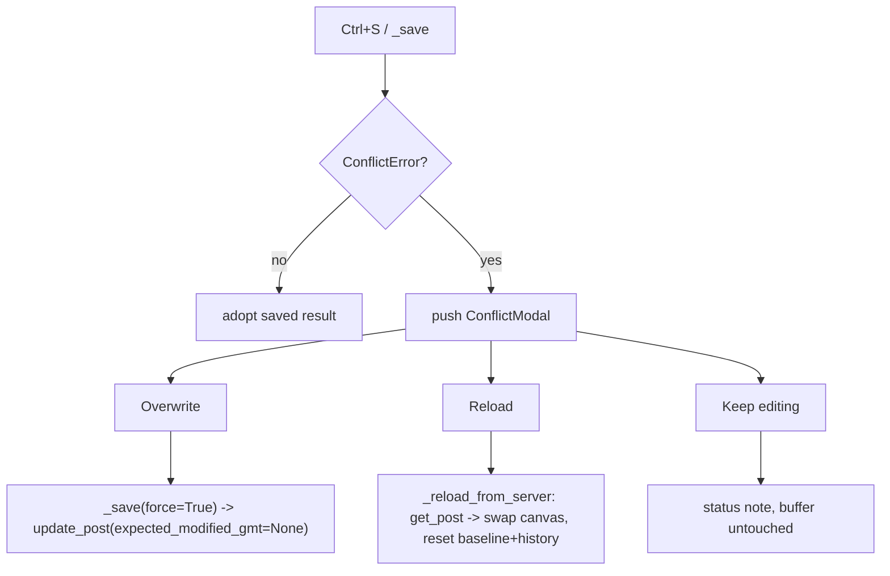

# feat: Conflict-resolution UX

## Summary

When a save is blocked because another author changed the post since it was loaded, replace
the dead-end status message ("Reload to get the latest") with a **conflict modal** offering
three clear actions: **Overwrite** (force-save my version), **Reload** (discard my edits and
load the server's), or **Keep editing** (dismiss and decide later). The lost-update detection
already exists (`ConflictError` from the `modified_gmt` pre-check); this adds the in-app way to
act on it.

**Product Contract preservation:** N/A — solo plan.

---

## Problem Frame

`WordPressClient.update_post` re-checks the server's `modified_gmt` before a PUT and raises
`ConflictError` (carrying `server_modified_gmt`) when another author saved in between
(`wptui/api/client.py`, `wptui/api/errors.py`). Today `EditorScreen._save` catches it and shows
only `"Not saved: … Reload to get the latest."` — the user's only recourse is to manually
reload (losing their edits) or keep hitting Ctrl+S (which keeps conflicting). There's no way to
**overwrite** deliberately, and reload isn't wired. The force path exists at the API layer:
`update_post(expected_modified_gmt=None)` skips the pre-check and overwrites.

---

## Requirements

- **R1** — On a save `ConflictError`, show a modal that states another author changed the post
  (with the server's modified time when available) and offers: Overwrite, Reload, Keep editing.
- **R2** — **Overwrite** re-saves the current buffer forcing past the conflict check (the PUT
  wins); on success the editor adopts the saved result as normal.
- **R3** — **Reload** re-fetches the post and replaces the editor buffer with the server's
  content, discarding local edits (the user's explicit choice); the editor's baseline
  (`modified_gmt`, settings, undo history) resets to the reloaded state so the next save
  doesn't immediately re-conflict.
- **R4** — **Keep editing** dismisses the modal and leaves the buffer untouched with a status
  note; nothing is saved or discarded.
- **R5** — The modal never fires for non-conflict errors (network, auth, validation keep their
  existing status-message handling).
- **R6** — Overwrite that itself fails (e.g. a second conflict or a network error) surfaces an
  error without corrupting the buffer or looping.

---

## Key Technical Decisions

- **KTD1 — A `ConflictModal` with three explicit choices.** A `ModalScreen` (mirroring the
  media/heading pickers) dismissing with `overwrite` / `reload` / `cancel`. Rationale: matches
  the established modal pattern; the three actions map exactly to the user's real options.
- **KTD2 — Force-save via `expected_modified_gmt=None`.** Thread a `force` flag through
  `_save` → `_commit_save`; when set, the update passes `expected_modified_gmt=None`, skipping
  the pre-check so the PUT overwrites. Rationale: the API already supports it; no client change.
- **KTD3 — Reload reuses the load path.** A `_reload_from_server` worker re-fetches with
  `get_post`, re-parses, swaps the canvas (like `_load`), and resets `modified_gmt`, `settings`,
  and the undo `DocumentHistory` baseline. Rationale: one code path for "make the buffer match
  the server"; resetting the baseline prevents an immediate re-conflict.
- **KTD4 — The conflict path is opt-in from `_save`'s existing `except ConflictError`.** Only
  that branch pushes the modal; other error branches are unchanged. Rationale: keep the blast
  radius to the conflict case (R5).

---

## High-Level Technical Design

The save→conflict→choice flow:

---

## Implementation Units

### U1. ConflictModal

**Goal:** A modal presenting the conflict and the three choices.

**Requirements:** R1

**Dependencies:** none

**Files:**
- `wptui/widgets/conflict_modal.py` (new)
- `tests/test_conflict_modal.py` (new)

**Approach:** A `ConflictModal(ModalScreen)` taking an optional server-modified-time string;
composes a title/message and three buttons (Overwrite, Reload, Keep editing) that dismiss with a
stable string result (`"overwrite"` / `"reload"` / `"cancel"`); Escape dismisses as `"cancel"`.
Layout CSS in `DEFAULT_CSS` so it renders in test harnesses. Mirror `MediaPickerModal` /
`HeadingLevelModal`.

**Patterns to follow:** `wptui/widgets/heading_level.py` and `wptui/widgets/media_picker.py`
(ModalScreen + buttons/list + dismiss-with-result + Escape-cancel + `DEFAULT_CSS`).

**Test scenarios:**
- Each button dismisses with its expected result (`overwrite`/`reload`/`cancel`).
- Escape dismisses with `cancel`.
- The server modified time, when provided, appears in the rendered message.

---

### U2. Editor wiring: force-save and reload

**Goal:** Route a save `ConflictError` to the modal and act on the choice.

**Requirements:** R2, R3, R4, R5, R6

**Dependencies:** U1

**Files:**
- `wptui/screens/editor.py` (`_save`/`_commit_save` `force` flag; conflict handler;
  `_reload_from_server`)
- `tests/test_conflict_resolution.py` (new)

**Approach:** Add `force: bool = False` to `_save` and `_commit_save`; when `force`, the update
passes `expected_modified_gmt=None`. In `_save`'s `except ConflictError` branch, push
`ConflictModal(err.server_modified_gmt)` with a callback: `overwrite` → `_save(force=True)`;
`reload` → `_reload_from_server()`; `cancel` → a status note. `_reload_from_server` is a worker
that `get_post`s, parses, removes the old canvas and mounts a fresh `BlockCanvas`, and resets
`self._modified_gmt`, `self._settings`, and `self._history = DocumentHistory(serialize(blocks))`
(mirroring `_load` but without the crash-recovery offer). Guard the whole thing behind the
`_saving` re-entrancy flag so a forced re-save doesn't overlap the original.

**Execution note:** Add a failing E2E first — a fake client that raises `ConflictError` on the
first update then succeeds when `expected_modified_gmt is None` — and assert Overwrite saves.

**Patterns to follow:** the existing `_save`/`_commit_save`/`_adopt` flow and `_load` in
`wptui/screens/editor.py`; the modal-dismiss-callback pattern (`action_add_image`/`_do_convert`).

**Test scenarios:**
- Save conflicts → `ConflictModal` is pushed (not just a status message).
- Overwrite → the save is re-issued with `expected_modified_gmt=None` and succeeds; the editor
  adopts the result (status shows saved).
- Reload → the canvas is replaced with the server's content, `modified_gmt` updates, the undo
  history baseline resets, and a subsequent save does not re-conflict.
- Keep editing → the buffer is unchanged (same serialized content) and nothing is saved.
- A non-conflict save error (network/auth) shows its status message and does **not** push the
  modal (R5).
- Overwrite that hits a second conflict/network error surfaces an error and leaves the buffer
  intact (R6).

---

## Scope Boundaries

**In scope:** a conflict modal with Overwrite / Reload / Keep editing; force-save; reload-from-
server with baseline reset.

### Deferred to Follow-Up Work
- **A visual diff** of local vs server content in the modal (v1 states the conflict; it doesn't
  show a three-way merge).
- **Merge** (keeping both versions or field-level merge) — v1 is overwrite-or-discard.
- **Conflict detection for autosave** or a live "someone else is editing" indicator.

### Not in scope (non-goals)
- Server-side revisions / WordPress revision UI.
- Detecting conflicts on anything but the `modified_gmt` pre-check already implemented.

---

## Risks & Dependencies

- **Reload discards local edits (medium).** Reload is destructive by design; it must only run on
  the explicit Reload choice, never automatically. Mitigation: only the modal callback triggers
  it; a status note confirms the choice.
- **Re-entrancy between the original save and a forced re-save (medium).** Mitigation: the
  existing `_saving` guard; the forced save runs after the modal dismisses (the original worker
  has returned), and resets `_saving` in its `finally`.
- **Baseline not reset after reload → immediate re-conflict (medium).** Mitigation: R3 resets
  `modified_gmt`/settings/history; a test asserts a post-reload save doesn't conflict.
- **Modal firing for non-conflict errors (low).** Mitigation: only the `except ConflictError`
  branch pushes it (R5), covered by a test.

---

## Verification

- New unit + E2E tests pass; the full suite stays green (`pytest`).
- Manual (or with a scripted fake): trigger a conflict, choose Overwrite → the edit lands;
  trigger again, choose Reload → the server version loads and the next save succeeds; choose
  Keep editing → nothing changes.

---

## Sources & Research

- `wptui/api/errors.py` — `ConflictError(server_modified_gmt=…)`.
- `wptui/api/client.py` — `update_post(expected_modified_gmt=…)` pre-check and the
  `expected_modified_gmt=None` skip path.
- `wptui/screens/editor.py` — `_save`/`_commit_save`/`_adopt`/`_load`, the `_saving` guard, and
  the current `except ConflictError` status message this replaces.
- `wptui/widgets/heading_level.py`, `wptui/widgets/media_picker.py` — the ModalScreen pattern.
- `wptui/history.py` — `DocumentHistory` for the reload baseline reset.
